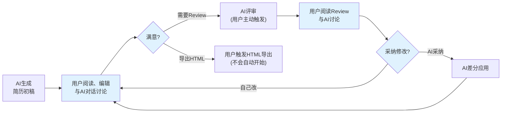
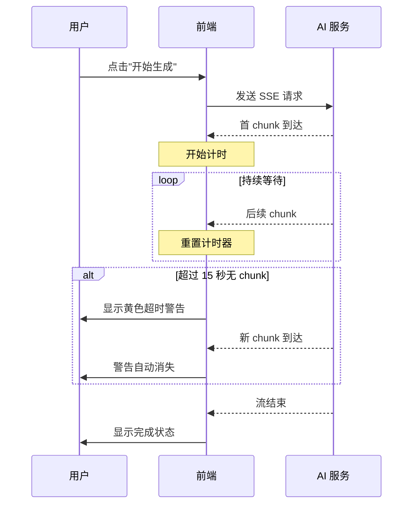
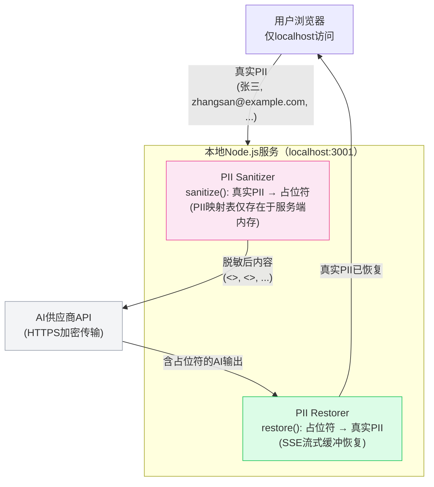

# 简历定制助手 — 设计文档

> 本文档供后续开发者阅读，以便理解项目全貌后继续开发。每次改动须在末尾 Change Log 追加记录。

[返回项目主页 (README.md)](./README.md)

---

## 1. 项目概述

**简历定制助手** 是一个本地 GUI Web 应用，用于根据 JD（Job Description）和简历素材库，利用多个 AI 模型自动生成、评审、修改定制简历和求职信，并最终转换为 HTML 供用户手动打印为 PDF。
- 用户无需在多个 AI 聊天窗口之间来回复制粘贴
- 一站式完成：生成 → 评审 → 修改 → HTML导出
- 支持多 AI 供应商（Jiekou.ai、OpenRouter.ai、Google AI Studio）和多种模型（OpenAI、Google、Anthropic）

### 运行环境
- macOS (Darwin 21.6.0)，MacBook Pro 2015，i7 2.2GHz 四核，16GB 内存
- **关键约束**：应用不能使机器卡死，`--max-old-space-size=512` 限制 Node.js 内存

---

## 2. 技术架构

```
+----------------------------------+
|  浏览器 (localhost:5173)         |
|  Vanilla JS SPA + CSS           |
|  index.html / src/main.js       |
|  src/api.js / src/state.js      |
+----------------------------------+
           | Vite Dev Proxy /api → :3001
+----------------------------------+
|  Express.js Server (:3001)       |
|  server/index.js                 |
|  server/routes/api.js            |
|  server/services/anthropic.js    |
|  server/services/gemini.js       |
|  server/services/openai-compat.js|
|  server/services/fileReader.js   |
|  server/prompts/templates.js     |
+----------------------------------+
```

### 技术栈
| 层 | 技术 | 说明 |
|---|---|---|
| 前端 | Vanilla JS + CSS | 无框架，单页应用 |
| 构建 | Vite 6 | 开发代理 + 生产构建 |
| 后端 | Express.js (Node.js ES Modules) | API 路由 + AI 调用 |
| AI SDK | `@anthropic-ai/sdk`, `@google/genai`, raw `fetch` | 三种调用方式 |
| 文件解析 | `mammoth`, Poppler `pdftotext` | DOCX/PDF 读取 |
| 数据持久化 | localStorage + AES-GCM 加密 | 凭证加密存储 |
| 实时通信 | Server-Sent Events (SSE) | AI 流式输出 |

### 启动方式
```bash
cd resumeTailor
npm run dev
# 浏览器打开 http://localhost:5173
```

停止：在终端按 Ctrl+C（可能需要多按几次或 `kill %1`）

生产模式：
```bash
npm run build
npm start
# 浏览器打开 http://localhost:3001
```

### 文件结构

```
vscCCOpus/
├── package.json              # 依赖和脚本
├── vite.config.js            # Vite 配置，代理 /api → :3001
├── index.html                # SPA 入口，包含设置弹窗和所有 UI
├── src/
│   ├── main.js               # 前端主逻辑 (~1100 行)
│   ├── api.js                # SSE 流式请求、文件操作封装
│   ├── state.js              # localStorage 状态管理 + AES-GCM 加密
│   └── style.css             # 所有样式
├── server/
│   ├── index.js              # Express 入口，CORS、JSON 限制 50MB
│   ├── routes/
│   │   └── api.js            # 所有 API 路由
│   ├── services/
│   │   ├── anthropic.js      # Anthropic Claude SDK 调用
│   │   ├── gemini.js         # Google GenAI SDK 调用
│   │   ├── openai-compat.js  # OpenAI 兼容 API (raw fetch)
│   │   ├── fileReader.js     # 文件读取 (txt/html/pdf/docx/md)
│   │   ├── libraryCache.js   # 素材库 digest 缓存系统
│   │   ├── mcp-client.js     # MCP Client（GitHub MCP Server 子进程管理）
│   │   └── agent-loop.js     # Agent 循环引擎（LLM + tool call 多轮）
│   └── prompts/
│       └── templates.js      # 所有 LLM Prompt 模板
├── config/                    # 运行时配置（.gitignore，不提交）
│   └── user-models.json      # 用户级 Gemini fallback 模型列表（自动生成）
├── test-e2e.mjs              # 综合测试套件（E2E + mock 单元测试）
└── DESIGN.md                 # 本文档
```

---

## 3. 多模型连接系统

### 3.1 两级配置架构

**第一级：模型连接配置** — 配置供应商 + API 凭证 + 模型 ID

7 个可选连接：

| Connection ID | 供应商 | 模型族 | SDK 路由 | 默认 URL |
|---|---|---|---|---|
| `jiekou-openai` | Jiekou.ai | OpenAI | OpenAI-compat | `https://api.jiekou.ai/v1` |
| `jiekou-google` | Jiekou.ai | Google | OpenAI-compat | `https://api.jiekou.ai/v1` |
| `jiekou-anthropic` | Jiekou.ai | Anthropic | Anthropic SDK | `https://api.jiekou.ai/anthropic` |
| `openrouter-openai` | OpenRouter.ai | OpenAI | OpenAI-compat | `https://openrouter.ai/api/v1` |
| `openrouter-google` | OpenRouter.ai | Google | OpenAI-compat | `https://openrouter.ai/api/v1` |
| `openrouter-anthropic` | OpenRouter.ai | Anthropic | OpenAI-compat | `https://openrouter.ai/api/v1` |
| `google-studio-google` | Google AI Studio | Google | Google GenAI SDK | （无，直连） |

**第二级：Agent 角色分配** — 将已配置的连接分配给 Agent

| Agent | 作用 | 选择方式 | 默认 |
|---|---|---|---|
| Generator | 简历/求职信生成 | 单选下拉 | `jiekou-anthropic` |
| Reviewer | 简历评审 | 多选复选框 | `google-studio-google` |
| Format Converter | HTML 转换；在本地 OCR 质量差时作为 JD 图片 OCR 的 AI 兜底 | 单选下拉 | `google-studio-google` |
| Preprocessor | 素材库 AI 预处理（可选） | 单选下拉 | `google-studio-google` |

补充说明：
- `Orchestrator` 作为可配置角色在"设置"中可见；用于 JD 解析及评审合并协调
- JD 解析的 AI 兜底默认复用 `Generator`
- `review-multi` 的合并与 Review 对话默认复用首个 `Reviewer`；若没有 Reviewer，则回退到 `Generator`

### 3.2 SDK 路由逻辑 (`getSdkType()`)

```
connectionId === 'google-studio-google'  → Google GenAI SDK (gemini.js)
connectionId === 'jiekou-anthropic'      → Anthropic SDK (anthropic.js)
其他所有                                  → OpenAI-compatible (openai-compat.js)
```

关键设计决策：
- `jiekou-anthropic` 走 Anthropic 原生 SDK，因为 Jiekou.ai 的 Anthropic 代理端点(`/anthropic`)与 Anthropic 官方 API 兼容
- `jiekou-openai`、`jiekou-google` 走 OpenAI-compatible，因为 Jiekou.ai 的 `/v1` 端点是 OpenAI 兼容格式
- OpenRouter 全部走 OpenAI-compatible
- Google AI Studio 走原生 Google GenAI SDK（需 VPN）

### 3.3 向后兼容

旧的 `model` 值自动映射：
- `'opus'` → `'jiekou-anthropic'`
- `'gemini'` → `'google-studio-google'`

旧的凭证也会自动迁移到新的 `connKey_*` 格式。

---

## 4. API 路由

所有路由前缀 `/api`：

| 方法 | 路径 | 说明 | 流式 |
|---|---|---|---|
| POST | `/init` | 初始化模型连接 | No |
| POST | `/list-models` | 列出 Google AI Studio 可用于本应用的免费 Gemini 文本模型 | No |
| GET | `/list-files` | 列出素材库文件 | No |
| GET | `/read-file` | 读取单个文件 | No |
| POST | `/save-file` | 保存文件 | No |
| POST | `/library-digest` | 素材库清洗+去重 digest | No |
| POST | `/generate` | 生成简历/求职信 | SSE |
| POST | `/review` | 单模型评审 | SSE |
| POST | `/review-multi` | 多模型并行评审 + 合并 | SSE |
| POST | `/chat` | AI 对话（通用） | SSE |
| POST | `/apply-review` | 根据评审意见 diff 修改简历 | SSE |
| POST | `/generate-html` | 生成 HTML | SSE |
| POST | `/extract-jd-info` | 从 JD 提取公司/部门/职位 | No |
| POST | `/route-intent` | Orchestrator 意图路由（analyze/generate/clarify） | No |
| POST | `/analyze-jd` | JD Analyzer skill：深度拆解 JD 并对照素材库评估匹配度 | No |
| POST | `/ocr-jd-images` | JD 图片 OCR 的 AI 兜底（仅用户主动触发） | No |
| GET | `/default-preprocess-prompt` | 读取默认预处理 prompt 文件 | No |
| POST | `/preprocess-library` | AI 预处理素材库 | SSE |
| POST | `/github/init` | 初始化 GitHub MCP Client（传入 token） | No |
| GET | `/github/status` | 查询 MCP Client 连接状态 | No |
| POST | `/github/analyze` | GitHub Agent：LLM + tool-calling 分析 GitHub 项目 | SSE |
| POST | `/github/disconnect` | 断开 MCP Client 连接 | No |

### `/init` 请求格式（新格式）
```json
{
  "modelConnections": [
    { "id": "jiekou-anthropic", "url": "https://api.jiekou.ai/anthropic", "key": "sk_v-...", "model": "claude-opus-4-6", "label": "Jiekou Anthropic" },
    { "id": "google-studio-google", "url": "", "key": "AIza...", "model": "gemini-2.5-flash", "label": "Google AI Studio" }
  ],
  "allowedPaths": ["/Users/wukun/Documents/tmp/resumeTailor/vscCCOpus", "/Users/wukun/Documents/jl"]
}
```

### SSE 数据格式
```
data: {"type":"chunk","text":"..."}
data: {"type":"progress","text":"..."}                                // 聚合进度文本
data: {"type":"progress","model":"conn-id","label":"Gemini","status":"pending|running|done|failed"}  // per-model 进度（review-multi）
data: {"type":"error","message":"..."}
data: {"type":"done"}
```

### `/list-models` 过滤策略

`POST /api/list-models` 当前仅服务于 `google-studio-google`，并且是一个**面向本应用场景的精简列表**，不是 Google 全量模型浏览器。返回结果满足以下约束：

- 仅返回适合简历/求职信生成场景的 **Gemini 文本模型**
- 仅返回免费可用模型，不显示 `pro`、deep research、robotics、computer use 等付费或专用模型
- 不显示图片/音频/TTS/embedding 等非文本模型
- 不显示 `latest`、`-001` 这类别名噪音，尽量保留用户真正需要手选的模型 ID

当前真实接口回归下，典型返回为 `gemini-2.5-flash`、`gemini-2.5-flash-lite`、`gemini-2.0-flash`、`gemini-2.0-flash-lite`、`gemini-3-flash-preview`、`gemini-3.1-flash-lite-preview`。

### 路径安全
服务端维护 `allowedDirs` 白名单，所有文件操作路径必须在白名单目录下。

---

## 5. 前端状态管理

### 5.1 `state.js` — localStorage + AES-GCM 加密

- 非敏感数据：`state.get(key)` / `state.set(key, value)` — 明文存 localStorage
- 敏感数据（API Key、PII 配置）：`state.getCredential(key)` / `state.setCredential(key, value)` — AES-GCM 加密
- 加密密钥通过 PBKDF2 从**稳定浏览器指纹**派生（`screen.width + screen.height + navigator.language`，不含 `navigator.userAgent`）
- 凭证 key 命名：`connKey_{connectionId}`（如 `connKey_jiekou-anthropic`）、`pii_*`（如 `pii_nameEn`）
- 非凭证配置 key：`connUrl_{connectionId}`、`connModel_{connectionId}`
- **解密失败保护**：`decryptValue` 失败时返回空字符串而非原始密文，防止密文被回写导致双重加密永久损坏
- **双重加密检测**：`setCredential` 在加密前检测值是否像 base64 密文（`looksLikeCiphertext`），若是则清空再保存
- **旧指纹兼容迁移**：`migrateCredential(key)` 先尝试稳定指纹解密，失败后尝试旧指纹（含 `userAgent`），成功则自动用稳定指纹重新加密；若检测到双重加密则清空数据
- 迁移由 `restoreState()` 在恢复凭证后自动调用

### 5.2 持久化的设置项
| Key | 说明 | 加密 |
|---|---|---|
| `connKey_*` | 每个连接的 API Key | 是 |
| `connUrl_*` | 每个连接的 URL | 否 |
| `connModel_*` | 每个连接的 Model ID | 否 |
| `generatorModel` | Generator Agent 对应的 connection ID | 否 |
| `reviewerModels` | Reviewer Agent 的 connection ID 数组 | 否 |
| `htmlModel` | Format Converter 的 connection ID | 否 |
| `libraryPath` | 简历素材库绝对路径 | 否 |
| `genInstructions` | 生成简历的 prompt 指令 | 否 |
| `reviewInstructions` | 评审简历的 prompt 指令 | 否 |
| `htmlInstructions` | HTML 转换的 prompt 指令 | 否 |
| `mockMode` | 仿真模式开关 | 否 |
| `reasoningOrchestrator` | Orchestrator 推理强度 | 否 |
| `reasoningGenerator` | Generator 推理强度 | 否 |
| `reasoningReviewer` | Reviewer 推理强度 | 否 |

### 5.3 工作区内容默认不持久化

当前版本进入应用时会自动清空工作区，不恢复上一次的 JD、生成结果、Review、聊天记录和 OCR 中间结果。保留的只有"设置层"信息，例如 API 连接、Agent 分配、素材库路径、指令和 PII 配置。

### 5.4 指令区文件加载/保存功能

#### 功能概述
新增功能：生成/评审/HTML指令区支持文件加载/保存

- **生成指令区**：提供"加载文件"和"保存文件"按钮
- **评审指令区**：同上
- **HTML指令区**：同上

#### 用户使用场景
- 用户可以保存模板指令（如专门针对特定岗位类型的生成指令）
- 后续使用时可以快速加载保存的指令模板
- 减少重复输入，提高工作效率

#### 前端实现
- 在 `src/main.js` 中实现 `handleLoadFile()` 和 `handleSaveFile()` 函数
- 支持三种类型：`'gen'`（生成指令）、`'review'`（评审指令）、`'htmlFormat'`（HTML格式指令）
- 使用 HTML5 File API 进行本地文件选择
- 保存时优先使用现代化 `window.showSaveFilePicker()` API，若浏览器不支持则降级为使用素材库目录
- 文件读取使用 `FileReader` API

#### 后端API支持
- `GET /api/read-file`：读取文件内容，路径必须在 `allowedPaths` 白名单内
- `POST /api/save-file`：保存文件内容，路径必须在 `allowedPaths` 白名单内
- 路径安全校验：所有操作受白名单限制，防止路径遍历攻击

#### 前端状态持久化
指令内容保存在以下状态键中：
- `genInstructions`：生成指令
- `reviewInstructions`：评审指令
- `htmlInstructions`：HTML格式指令

这些状态在 `localStorage` 中持久化，应用重启时自动恢复。

#### 折叠区展开状态记忆
4 个指令区 `<details>` 元素标记 `class="remember-state"`，其展开/折叠状态通过 `resumeTailor_collapsedStates` 键持久化：
- `preprocessInstructionsSection`：预处理指令
- `genInstructionsDetails`：生成指令
- `reviewInstructionsDetails`：评审指令
- `htmlFormatDetails`：HTML 格式指令

持久化时机：`toggle` 事件触发时（用户展开/折叠操作）。
恢复时机：`restoreState()` 执行时，在凭证和草稿恢复之间。
实现：`persistDetailsState()` 遍历 `.remember-state` 元素保存 `{ id: open }` 对象；`restoreDetailsState()` 读取并逐一恢复 `open` 属性。

#### 文件命名建议
建议使用有意义的文件名保存指令模板，例如：
- `generator-instruction-finance-role.txt`
- `reviewer-instruction-software-engineer.txt`
- `html-format-two-column-clean.txt`

---

## 6. Prompt 模板

### 6.1 `getResumeGenerationPrompt`
- 输入：JD、原始简历、简历库、指令、是否生成求职信
- 输出格式强制要求三段式：`===== 简历正文 =====` / `===== 求职信正文 =====`（可选）/ `===== AI备注 =====`
- 前端 `parseGeneratedOutput()` 解析分隔符，将正文与备注分开显示

### 6.2 `getReviewPrompt`
- 动态检测 `updatedResume` 是否包含「求职信」，有则追加求职信评审格式要求
- 评审要点：事实一致性、篇幅、关键词堆砌、深度、诚实度、数字一致性
- 用户可通过独立"评审指令"输入框自定义评审要求，prompt 中以"评审指令（用户自定义要求）"段落注入

### 6.3 `getReviewMergePrompt`
- 用于多 Reviewer 场景：多个模型并行评审后，由内部编排层默认复用首个 Reviewer 模型合并评审意见
- 使用实际的 connection label 标识各评审员
- 后端为每个模型发出 per-model 进度事件（pending → running → done），前端逐模型渲染状态指示器

### 6.4 `getHtmlGenerationPrompt`
- 硬性要求：2 页 A4 以内、CSS @page 规则、紧凑排版
- 用户的格式要求放在 prompt 最前面以获得最大权重
- 输出纯 HTML 代码，不要解释文字

---

## 7. 跨投递一致性检查 (Cross-Submission Consistency)

当用户为某公司某岗位生成简历时，系统自动检测素材库中是否存在之前向**同一公司**投递过的简历/求职信，如果存在，则将这些历史投递内容作为上下文传递给 AI，并注入详细的一致性约束规则。

### 7.1 前端检测逻辑

`findSameCompanyFiles(companyName)` 在 `src/main.js` 中实现：

1. 解析素材库文件列表的文件名，格式为 `name - type - {company} - {dept} - {title} - {date}.txt`
2. 提取第 3 个 `-` 分隔段（即公司名），与当前 JD 的公司名进行**大小写不敏感**匹配
3. 排除当前选中的基础简历（即 `baseResumeSelect.value`），避免与 `originalResume` 重复（该文件已作为"原始简历"单独传入 prompt）
4. 匹配到的文件内容拼接为 `previouslySubmitted` 字符串

> **关于排除逻辑的两种典型场景**：
>
> - **场景 A — 基础简历是通用主简历**（如 `base-resume.txt`，文件名不含公司名）：排除逻辑**不会触发**，因为通用简历的文件名不会匹配公司检索条件。所有同公司历史投递均完整进入 `previouslySubmitted`。AI 同时参考 `originalResume`（原始事实基础）和 `previouslySubmitted`（历史投递一致性约束）生成新简历。这是最常见的使用方式——用户基于同一份通用主简历，为同公司不同岗位生成多份定制简历，每份定制简历已经与通用主简历不同（面向不同 JD 裁剪过），AI 需要看到所有历史投递来保持一致。
> - **场景 B — 基础简历本身就是某份已投递的同公司简历**（如 `wukun - resume - Amazon - AGS - PM - 2026-04-01.txt`）：该文件被排除，因为它已作为 `originalResume` 出现在 prompt 中，再放入 `previouslySubmitted` 会造成内容重复。其余同公司投递正常进入 `previouslySubmitted`。AI 仍能看到所有信息，不会遗漏。

### 7.2 UI 提示

匹配成功时，输出区显示黄色警告栏（`#sameCompanyHint`）：

```
⚠️ 检测到已向 {company} 投递过 {N} 份简历/求职信，将自动进行跨投递一致性约束
```

样式类 `.same-company-hint`：黄色背景 + 琥珀色边框，定义在 `src/style.css`。

### 7.3 API 传递

`previouslySubmitted` 字段通过前端 `doGenerate()`、`doReview()`、`doApplyReview()` 发送到以下后端路由：

| 路由 | 用途 |
|------|------|
| `POST /api/generate` | 生成时注入一致性约束 |
| `POST /api/review` | 评审时增加跨投递一致性检查维度 |
| `POST /api/review-multi` | 多模型评审时同上 |

### 7.4 生成 Prompt 注入规则

当 `previouslySubmitted` 非空时，`getResumeGenerationPrompt` 注入以下分层约束：

- **事实层硬性约束**：时间线、Title、公司名、项目名、数据指标、专利/论文、教育背景必须与历史投递**完全一致**；不能凭空新增之前未出现过的技能
- **表达层可调整**：Summary/Skills 排列顺序、项目要点的侧重角度、关键词选择可根据目标岗位灵活调整
- **最终效果**：在 HR 眼中看起来是「同一份经历的两个不同侧面」，而非前后矛盾的两份简历

### 7.5 评审 Prompt 扩展

当 `previouslySubmitted` 非空时，`getReviewPrompt` 增加：

- 评审维度追加「跨投递一致性检查」：核查事实层是否与历史投递矛盾
- 评审输出格式追加专门的「跨投递一致性」评审小节

---

## 8. JD 图片输入与 OCR 策略

新增能力：JD 不再只支持用户粘贴的纯文本，也支持上传 `1..N` 张职位截图图片（常见为社交媒体平台导出的 `JPG` / `PNG` / `WebP`）。

### 8.1 设计原则

- **本地识别优先或 AI 直接识别**：用户可选择"直接用 AI 识别"；若未勾选，图片先在浏览器端做本地 OCR（不消耗 Token），质量不佳时再提供 AI 补救按钮。
- **文本仍是唯一真源**：无论是本地还是 AI 识别，结果最终都被追加/替换到 `jdInput` 中，后续流程仅消费 JD 文本。
- **AI 角色复用**：AI 识别（包括直接识别和补救识别）均调用 `Format Converter` 角色分配的模型（通常是 Gemini）。

### 8.2 前端流程

1. 用户选择多张 JD 图片。
2. 系统检查"直接用 AI 识别"勾选状态：
   - **若勾选**：直接将图片发送至后端 `/api/ocr-jd-images`，调用 `Format Converter` 进行识别。
   - **若未勾选**：
     - 前端按上传顺序逐张预处理（缩放、灰度/二值化）。
     - 使用浏览器端 Tesseract.js 提取文本。
     - 将文本追加到 `jdInput`。
     - 执行本地质量检查（长度、关键词命中、异常字符）。
     - 质量差时展示"用 AI 改进识别"按钮。
3. 识别结果追加到 `jdInput`。

### 8.3 AI 兜底与补救
- 路由：`POST /api/ocr-jd-images`
- 输入：图片数组（base64）
- 输出：整理后的 JD 纯文本
- 状态：仅在初始勾选 AI 或后续补救时调用，主流程不重复发送图片。
- **上下文隔离**：该路由添加了 system prompt（声明每次请求独立、禁止回忆历史内容）和唯一请求 ID（打破供应商服务端缓存关联），temperature 设为 0，以防止 Google Gemini API 等供应商的服务端上下文缓存导致历史 OCR 结果泄漏到当前响应中。

JD 输入框中只保留最终的 JD 纯文本，不写入批次号、图片文件名或其他技术分隔符，因此不会额外污染 prompt，也不会为这些辅助标记消耗 token。

---

## 9. AI 预处理素材库功能

### 9.1 功能概述

用户可选择使用 AI 来预处理简历素材库，AI 预处理能够更智能地提取、整理和优化素材内容。

### 9.2 核心设计决策

1. **AI 预处理与本地预处理隔离**：
   - AI 预处理仅影响"导出预处理文本素材库"链路
   - 不改变 generate/review 的现有本地预处理逻辑
   - `digest.json` 缓存通过 `mode` 字段区分：`local` vs `ai`

2. **缓存语义**：
   - AI 缓存命中条件：素材文件未变化 + 预处理 prompt 未变化 + preprocessor model 未变化
   - 本地缓存和 AI 缓存互相独立，避免污染

### 9.3 前端 UI

1. **Settings Agent 配置**：
   - 新增 Preprocessor Agent 下拉选择器
   - 默认使用 `google-studio-google`（免费 Gemini）

2. **素材库区域新增**：
   - "使用 AI 预处理" 复选框
   - 预处理指令 `<details>` 区域（类似 genInstructions）
   - "和预处理助手对话（确认/追问）" 对话区域

3. **导出按钮行为**：
   - 未勾选 AI 时：走本地预处理（现有逻辑不变）
   - 勾选 AI 时：读取原始素材 → AI 预处理 → 保存 digest.json → 导出 txt

### 9.4 后端 API

| 路由 | 说明 |
|------|------|
| `GET /api/default-preprocess-prompt` | 读取默认 prompt 文件 |
| `POST /api/preprocess-library` | AI 预处理素材库 |

### 9.5 POST /api/preprocess-library 请求格式

```json
{
  "dir": "/path/to/library",
  "model": "gemini-2.5-flash",
  "instructions": "用户自定义预处理指令",
  "messages": [{ "role": "user", "content": "..." }],
  "excludeNames": ["排除的文件名"]
}
```

### 9.6 预处理输出协议

AI 预处理使用分隔符协议，便于流式展示后解析：

- `===== 预处理文本开始 =====` ... `===== 预处理文本结束 =====` — 表示完成
- `===== 需要用户确认 =====` — 表示仍需用户输入

### 9.7 缓存 schema 升级

`digest.json` 新格式：

```json
{
  "version": "v7",
  "mode": "ai",
  "key": "hash-of-files+prompt+model",
  "digest": [{ "name": "__ai_preprocessed__", "content": "..." }],
  "exportText": "完整预处理文本",
  "sourceTokens": 1000,
  "digestTokens": 600,
  "updatedAt": "2026-04-23T..."
}
```

### 9.8 Token 统计

预处理对话区显示：
- `sourceTokens`：原始素材 token 数
- `digestTokens`：预处理后 token 数

### 9.9 失败回退

AI 预处理失败时自动回退到本地预处理，并在系统消息中提示"已回退到本地预处理"。

### 9.10 默认 Prompt 来源

硬编码路径：`/Users/wukun/Documents/jl/预处理-prompt.md`

用户未输入自定义 prompt 时，通过 `/api/default-preprocess-prompt` 读取该文件作为默认值。

---

## 9.5 JD Analyzer（S1）

### 功能概述

新增 Orchestrator 意图路由 + JD Analyzer skill，为用户提供"事前评估"：在 Generate 之前，用素材库直接对照 JD 计算覆盖度，判断值不值得生成。

### 与 Reviewer 打分的区别

| | JD Analyzer | Reviewer 打分 |
|---|---|---|
| 时机 | 生成前 | 生成后 |
| 依据 | 素材库 vs JD | 生成的简历 vs JD |
| 目的 | 决定投不投 | 决定改不改 |
| 成本 | 1 次轻量调用 | Generate + Review 两次调用 |

### 触发流程

**两种入口**：

| 入口 | 行为 | 适用场景 |
|------|------|---------|
| 「分析 JD」按钮 | 直接调用 Analyzer，跳过意图路由 | 用户明确要分析 |
| Query 输入框 | 先调 `/api/route-intent` → analyze 调 Analyzer / generate 提示 / clarify 反问 | 用户用自然语言表达意图 |

**按钮流程（直接分析）**：
1. 用户点击「分析 JD」按钮
2. 直接调用 `/api/analyze-jd` → 展示分析报告
3. 用户看完报告后点击「生成简历」，分析结果自动注入到生成指令中

**Query 框流程（意图路由）**：
1. 用户在 Query 框输入自然语言（如"这个岗位怎么样？"）
2. 前端调用 `/api/route-intent`，Orchestrator LLM 分类意图
3. `analyze` → 调用 `doAnalyzeJd()` → 展示分析报告
4. `generate` → 提示用户直接点「生成简历」按钮
5. `clarify` → 反问用户意图，提示明确输入

### API 端点

**`POST /api/route-intent`** — 意图分类（轻量，maxTokens=256，非流式）
```json
// 请求: { model, query, jd, mock }
// 响应: { intent: "analyze"|"generate"|"clarify", reason, usage }
```

**`POST /api/analyze-jd`** — JD Analyzer skill（maxTokens=1024，非流式）
```json
// 请求: { model, jd, resumeLibrary, mock }
// 响应: {
//   hardRequirements: [{req, hasEvidence, sources[], gap}],
//   niceToHaves: [...],
//   strengths: [], weaknesses: [],
//   jobLevel: "junior|mid|senior|staff",
//   matchVerdict: "有戏|勉强|没戏",
//   matchReason, usage
// }
```

### 分析结果集成

`doGenerate()` 检测 `lastAnalysisResult`，若存在则将优势区/短板区/无素材支撑要求注入生成指令前部，引导 Generator 侧重点。

### UI

- 「分析 JD」按钮位于「生成简历」按钮左侧，secondary 样式
- 分析报告展示为可折叠 `<details>` 区域，位于 action-bar 下方
- 匹配度用颜色编码：绿色=有戏，黄色=勉强，红色=没戏

---

## 9.6 MCP Client — GitHub 集成（M1）

### 功能概述

新增 MCP Client 服务，通过 Model Context Protocol 接入 GitHub MCP Server，使 Agent 能够自动读取用户的 GitHub 仓库数据，辅助素材库构建和简历生成。

### 架构设计

```
+-------------------+     stdio      +---------------------------+
| Express 后端       | <===========> | GitHub MCP Server          |
| mcp-client.js     |   subprocess  | (npx @modelcontextprotocol|
| agent-loop.js     |               |  /server-github)           |
+-------------------+               +---------------------------+
        |
        | Agent Loop (多轮 LLM + tool call)
        |
+-------------------+
| AI SDK callers    |
| (anthropic/gemini/|
|  openai-compat)   |
+-------------------+
```

### 核心组件

1. **`server/services/mcp-client.js`** — MCP Client 封装
   - `init(token)` — spawn GitHub MCP Server 子进程（stdio transport）
   - `listTools()` — 列出可用工具
   - `callTool(name, args)` — 调用工具
   - `close()` — 关闭连接

2. **`server/services/agent-loop.js`** — Agent 循环引擎
   - 多轮 LLM 调用 + 工具执行循环
   - 自动转换 MCP tools 到各 SDK 格式（Anthropic/OpenAI/Gemini）
   - 最大 10 轮迭代防止死循环
   - 累计 token 用量统计

3. **Tool-calling 支持** — 三个 AI SDK caller 均新增 `opts.tools` 参数
   - `anthropic.js` — 流式 `tool_use` 块追踪
   - `openai-compat.js` — 流式 `tool_calls` 累积
   - `gemini.js` — `functionDeclarations` + `functionCall` 检测

### 暴露给 LLM 的只读工具

| 工具 | 说明 |
|------|------|
| `search_repositories` | 搜索仓库 |
| `get_file_contents` | 读取仓库文件（如 README） |
| `list_commits` | 查看提交历史 |
| `search_code` | 搜索代码 |
| `search_issues` | 搜索 Issues |
| `search_users` | 搜索用户 |

写操作工具（create_issue、push_files 等）不暴露给 LLM。

### API 端点

- `POST /api/github/init` — 初始化 MCP Client，传入 GitHub token
- `GET /api/github/status` — 查询连接状态
- `POST /api/github/analyze` — 运行 GitHub Agent（SSE 流式）
- `POST /api/github/disconnect` — 断开连接

### 用户配置

GitHub Token 在设置弹窗中配置，使用 AES-256-GCM 加密存储（复用现有机制）。Token 权限最小化：只需 `repo:read`。

### 前端 UI

- 设置弹窗新增「GitHub 集成」配置区：Token 输入 + 连接测试
- 输入区新增「GitHub 项目分析」：query 输入框 + 分析按钮 + 折叠报告区域

---

## 10. UI 布局

```
+-----------------------------------------------+
|  Header: [简历定制助手]  [仿真模式] [设置]    |
+-----------------------------------------------+
|  输入区                                      |
|  ├ JD 输入框 + JD图片上传 / OCR状态           |
|  ├ 素材库路径 + 浏览/加载/导出预处理文本按钮    |
|  ├ 基础简历下拉选择                             |
|  ├ 手动输入简历（按需显示）                      |
|  ├ [折叠] 生成指令                             |
|  ├ [折叠] HTML 格式指令                        |
|  └ [同时生成求职信] [生成简历]                   |
+-----------------------------------------------+
|  输出区（始终可见）                             |
|  +-------------------+-------------------+     |
|  | 简历/求职信 面板   | Review 面板       |     |
|  | [保存] [重新生成]  | [开始Review]      |     |
|  |                  | [采纳并更新简历]    |     |
|  | 简历编辑区        | Review 结果编辑区  |     |
|  | AI备注(折叠)      |                  |     |
|  | 生成助手对话框     | Review 对话框     |     |
|  +-------------------+-------------------+     |
|  +--------------------------------------+      |
|  |  [生成HTML并下载]                      |     |
|  |  HTML 助手对话框 + PDF 上传            |     |
|  +--------------------------------------+      |
+-----------------------------------------------+
```

### 设置弹窗
- 宽度 820px (`.modal-wide`)
- **模型连接配置**：3 个可折叠的供应商区块，每块一个表格（模型类型 / URL / Key / Model ID）
- **Agent 模型分配**：3 个选择器（Generator / Reviewer / Format Converter），从已配置连接中动态生成选项
- 动态更新：用户在连接表中填入 API Key 后，Agent 分配区的下拉选项即时刷新

---

## 11. 文件命名与保存

### 命名规则
`wukun - {type} - {company} - {department} - {title} - {YYYY-MM-DD}.{ext}`

- `type`：`resume`
- 公司/部门/职位由内部 JD 解析流程从文本 JD 中提取（先本地规则，再由 `Generator` 做 AI 兜底）；若 JD 最初来自图片，也会先在前端 OCR 成文本
- 中文 JD 对应中文文件名，英文 JD 对应英文文件名
- 如果提取不到公司名，仅在手动保存时询问用户

### 自动保存
- 生成简历后自动保存 `.txt` 到素材库目录
- HTML 只触发浏览器下载，不自动保存到素材库

### PDF 文件名
- HTML `<title>` 标签注入为 `wukun - resume - company - dept - title - date`
- 浏览器打印 PDF 时自动使用 `<title>` 作为文件名

---

## 12. 仿真模式 (Mock Mode)

勾选「仿真模式」后，所有 AI 调用返回预设文本，不消耗 API Token。

Mock 数据包含：
- `resume`：模拟简历正文
- `coverLetter`：模拟求职信（仅当勾选「同时生成求职信」）
- `notes`：模拟 AI 备注
- `review` / `reviewCoverLetter`：模拟评审（根据是否有求职信动态拼接）
- `reviewMerge` / `reviewMergeCoverLetter`：多模型合并评审
- `chat`：模拟聊天回复
- `html`：模拟 HTML 输出
- `extractJdInfo`：模拟 JD 解析结果
- `jdOcr`：模拟 JD 图片 OCR 兜底结果

---

## 13. 安全设计

| 威胁 | 对策 |
|---|---|
| API Key 泄露 | AES-GCM 加密存储在 localStorage |
| 路径遍历攻击 | 服务端 `allowedDirs` 白名单校验 |
| CORS 攻击 | 仅允许 localhost 源 |
| 简历内容截获 | 纯本地应用，不经过第三方（API 代理除外） |
| XSS | 无用户生成的 HTML 直接注入 DOM |

---

## 14. 多模态支持

### 支持的场景
- HTML 助手对话中上传 PDF/图片，让 AI 查看排版问题（base64 多模态方式）

### PDF 文本提取（简历素材库）

简历素材库中的 PDF 文件使用 Poppler `pdftotext -raw` 命令行工具提取文本，而非 npm 包。优势：
- 系统依赖：需预装 Poppler（`brew install poppler`），当前版本 v26.02.0
- 对中文 PDF 支持更好
- `-raw` 输出紧凑纯文本，节省 token（相比 `-layout` 减少空格填充）
- 减少 npm 依赖，输出纯文本直接注入 prompt

实现位于 `server/services/fileReader.js` 的 `readPdf()` 函数，使用 `execFile`（非 `exec`）避免 shell 注入。

### 多模态内部格式（HTML 助手上传路径）
```json
{ "type": "file", "mimeType": "application/pdf", "data": "base64..." }
```

### 各 SDK 的转换
| SDK | PDF | 图片 |
|---|---|---|
| Anthropic | `{ type: "document", source: { type: "base64", ... } }` | `{ type: "image", source: { type: "base64", ... } }` |
| Google GenAI | `{ inlineData: { mimeType, data } }` | 同左 |
| OpenAI-compat | `[Attached file: ...]`（文本占位） | `{ type: "image_url", image_url: { url: "data:..." } }` |

---

## 15. AI 不确定性管理：约束、降级与护栏

> 构建AI-Native产品的核心挑战：AI的输出是概率性的，不是确定性的。本节记录Resume Tailor如何在系统层面管理AI的不确定性。

### 15.1 约束层（System Constraints）— 限定AI行为边界

| 约束 | 应用场景 | 实现方式 |
|------|---------|---------|
| **结构化输出格式** | 简历生成 | 强制三段式分隔符（`===== 简历正文 =====` / `===== AI备注 =====`），前端解析器拒绝不合格输出 |
| **事实诚实性硬约束** | 生成+评审 | Prompt注入："必须诚实，不得编造经历、数据或证书" |
| **跨投递一致性约束** | 同公司多次投递 | 分层规则：事实层锁定（Title/时间线/数据必须一致），表达层灵活（侧重点可调） |
| **篇幅限制** | 生成+HTML | "必须在2页A4内" |
| **输出token上限** | 每条API路由 | 按路由校准：JD解析=256, 评审=3072, 生成=8192，防止AI过度输出 |
| **Body-only HTML** | HTML生成 | AI只输出`<body>`内HTML，系统用预置CSS模板组装完整文档 |

### 15.2 降级层（Fallbacks）— AI失败时的优雅退化

```mermaid
flowchart TD
    subgraph "JD信息提取"
        JD1["本地正则解析<br/>(tryLocalJdParse)"] -->|成功| JD_OK["使用本地结果<br/>0 token消耗"]
        JD1 -->|失败| JD2["AI提取<br/>(/extract-jd-info)"]
        JD2 -->|失败| JD3["用户手动输入"]
    end

    subgraph "模型自动切换（Model Fallback）"
        M1["首选模型<br/>(高性能)"] -->|配额不足/错误| M2["备用模型1<br/>(Flash Lite)"]
        M2 -->|配额不足/错误| M3["备用模型2<br/>(Flash)"]
        M3 -->|配额不足/错误| M4["备用模型3<br/>(Pro)"]
        M4 -->|所有模型失败| M5["提示用户更换API Key"]
        M2 -->|成功| M_OK["使用备用模型<br/>继续处理"]
        M3 -->|成功| M_OK
        M4 -->|成功| M_OK
    end

    subgraph "评审意见应用（差分模式）"
        D1["AI输出结构化差分指令"] --> D2["严格正则解析"]
        D2 -->|失败| D3["宽松正则解析<br/>(容忍空格差异)"]
        D3 -->|失败| D4["降级：完整重新生成<br/>(指令：保留用户编辑)"]
        D2 -->|成功| D5["差分应用：精确匹配<br/>→ 去空格匹配<br/>→ 行级规范化匹配"]
        D3 -->|成功| D5
        D5 -->|部分失败| D6["应用成功的+提醒失败的"]
    end

    style JD_OK fill:#dcfce7
    style M_OK fill:#dcfce7
    style D6 fill:#fef3c7
```



**Model Fallback 机制**：
- **智能模型优先级**：按性能和配额将模型分为3个优先级（Flash Lite → Flash → Pro）
- **自动切换策略**：配额错误等待5秒后重试，其他错误等待15秒后重试
- **成功恢复**：成功调用后重置模型索引，优先使用高性能模型
- **用户可配置优先级**：在设置页面可以通过拖拽调整 Fallback 模型的优先顺序
- **配置持久化**：用户自定义的模型优先级会保存到本地，下次启动自动加载
- **多源配置加载**：优先级顺序为 环境变量 > 用户配置文件 > 全局配置文件 > 默认硬编码
- **默认模型优先级**：
   1. **最优先级**（速度极快、配额最高）：gemini-3.1-flash-lite-preview、gemini-2.5-flash-lite、gemini-2.0-flash-lite
   2. **综合能力最强**：gemini-3-flash-preview、gemini-2.5-flash、gemini-2.0-flash
   3. **高级能力**（配额较低）：gemini-3.1-pro-preview、gemini-3-pro-preview、gemini-2.5-pro

**差分匹配三层容错的设计意义**：AI输出的修改指令（"把A改成B"）中的"A"经常和原文有微小差异（多余空格、换行不一致等）。三层匹配确保即使AI不够精确，修改也不会静默丢失：

| 层级 | 匹配策略 | 容忍的差异 |
|------|---------|-----------|
| 第1层 | 精确字符串匹配 | 无 |
| 第2层 | 去除首尾空格后匹配 | 空格、制表符 |
| 第3层 | 按行规范化后匹配 | 换行符、行内多余空格 |
| 最终降级 | 完整重新生成 | 所有（但保留用户编辑指令） |

### 15.3 护栏层（Guardrails）— 防止有害输出

| 风险 | 护栏 |
|------|------|
| **编造经历/数据** | Prompt硬约束 + Review明确检查项："是否存在原始素材中不支持的声明？" |
| **同公司简历矛盾** | 自动检测历史投递 → 注入分层一致性约束 → Review追加跨投递检查维度 |
| **关键词堆砌** | Review检查项："是否存在不自然的关键词堆砌？" |
| **过度包装** | Review检查项："诚实度与过度包装检测——标记无法被原始素材支持的声明" |
| **破坏用户编辑** | 差分模式（AI只输出修改指令而非全量重写） + Prompt指令"保留所有用户手动编辑" |
| **AI成本失控 / 成本黑箱** | 每路由maxTokens上限 + 模型配额可见（RPM/RPD/TPM）+ 每次调用后显示input/output token与折算费用 + 会话累计成本 + 仿真模式 |

> **Token/费用透明化也是一种 Guardrails**：它防的不是"错误答案"，而是"成本上的不确定性惊吓"。用户不再处于"先点生成，事后看账单"的黑箱里，而是始终知道这一步用了多少、这一轮累计多少、所选模型处于什么配额档位。

### 15.4 人在回路（Human-in-the-Loop）设计

Resume Tailor遵循的原则：**AI提议，人做决定**。



**一切操作由用户主动触发**：
- Review不会在生成后自动开始——用户点击"开始Review"
- HTML导出不会自动开始——用户点击"生成HTML并下载"
- 采纳修改不会自动应用——用户点击"采纳并更新简历"

### 15.5 响应等待超时提示

当网络波动或 AI 模型响应缓慢时，SSE 流可能长时间没有数据输出，用户容易误以为程序卡死。本功能提供实时反馈：

- **触发条件**：SSE 流收到首条 chunk 后，若后续间隔超过 **15 秒** 无新数据
- **提示位置**：当前操作对应的 status 区域旁的专用警告 span（与进度文案同时显示，不覆盖）
- **提示样式**：黄色文字 "⚠ AI 响应较慢，请稍候..."，独立于进度状态文案
- **自动恢复**：一旦收到新 chunk，警告自动消失，进度恢复正常



**实现要点**：
1. 在 `streamRequest()` 中维护 `lastChunkTime` 和 `firstChunkReceived` 标志
2. 每次 `reader.read()` 后检查：`if (firstChunkReceived && Date.now() - lastChunkTime > 15000) onTimeout(msg)`
3. 前端各调用点通过第 5 个参数传入 `onTimeout` 回调，显示对应区域的专用超时警告 span
4. 通过第 6 个参数 `onStreamResumed` 回调，在数据恢复后自动隐藏警告

---

## 16. Token 成本优化战略

> 核心策略：**不变的上下文预处理一次、持久化缓存、后续直接复用。能本地处理的，不用AI。**

### 16.1 优化效果总览

| 阶段 | 优化方向 | 效果 |
|------|---------|------|
| 第一阶段：Input token | 素材库去重缓存、本地JD解析、供应商Prompt Caching | **75-87% 节省** |
| 第二阶段：Output token | 差分模式、精简prompt、Body-only HTML | **52% 节省** |
| 第三阶段：审计 | 缓存标记优化、CSS精简、差分鲁棒性 | 额外缓存收益 |

### 16.2 Input Token优化策略


| 策略 | 节省 |
|------|------|
| 素材库段落级MD5去重 + 磁盘缓存 | 缓存命中时100%，首次30-60% |
| 本地JD解析（正则提取公司/部门/职位） | 每次~1600 token |
| 供应商Prompt Caching（利用部分供应商API的缓存特性，对重复发送的大块内容标记缓存控制标识，服务端缓存后续请求该部分大幅降低费用） | 缓存命中时90% |
| 聊天历史滑动窗口 + base64清理 | 上限控制在~20K |
| PDF用本地Poppler `pdftotext`提取（非AI OCR） | 远低于AI解析成本 |

### 16.3 Output Token优化策略

| 策略 | 节省 |
|------|------|
| 差分模式应用评审：AI输出`[REPLACE]<<<旧文本>>>新文本[/REPLACE]`而非全量重写 | **79%** |
| Body-only HTML：AI只输出`<body>`内容，前端组装完整文档 | **30%** |
| 多模型评审精简格式：每个Reviewer只输出评分+5条问题+5条建议 | **54%** |
| 按路由校准maxTokens上限 | 防止浪费 |
| 聊天分型system prompt（review/generator/html各不同） | **33%** |

### 16.4 Token与费用透明化：把成本从黑箱变成可管理预期

Token优化解决的是"少花钱"，Token透明化解决的是"别让用户不知道花了多少钱"。二者结合，才构成完整的成本Guardrails。

| 当前已实现的透明化能力 | 产品价值 |
|----------------------|---------|
| **每次调用后显示input/output token** | 用户能看到每一步真实消耗，不再只凭体感判断"这次是不是很贵" |
| **按供应商/连接折算实际费用** | 让"模型选择"从抽象偏好变成可量化决策 |
| **会话级累计成本展示** | 避免用户在一次多轮迭代中失去预算感知 |
| **免费模型明确标注为免费额度** | 降低试错心理门槛，适合先跑工作流再切付费模型 |
| **模型查询时展示RPM/RPD/TPM** | 把可用配额与吞吐能力前置展示，帮助用户预判"便宜但慢"还是"强但配额低" |
| **Orchestrator 调度白盒化与自动降级** | 摒弃隐性硬编码，系统自动探测各提供商连接组构建动态模型矩阵，基于输入输出单价算子对可用轻量模型进行极寒降级（优先免费层），打上推荐标签引导用户节约基础流转花销 |

这部分能力的意义不只是"做了个计数器"，而是在AI产品里补上一个常被忽视的产品层护栏：**把成本不确定性显式化、可解释化、可比较化**。对预算敏感的求职者来说，这种确定感本身就是核心价值。

---

## 17. 安全实现细节

### 17.1 零信任数据架构

Resume Tailor采用**纵深防御（Defense in Depth）**策略，构建七层安全防线：



**七层纵深防御**：

| 层级 | 防御措施 | 防护目标 | 实现方式 |
|------|---------|---------|---------|
| **L1 本地运行** | 全部代码在localhost运行，无云服务器、无数据库 | 消除数据在途风险和服务端存储风险 | Node.js + Vite本地开发服务器 |
| **L2 PII脱敏** | 所有PII在发送AI API前自动替换为占位符，返回后自动恢复 | **即使AI供应商日志被完全泄露，攻击者也无法还原用户身份** | 服务端拦截层，覆盖全部7条AI路由 |
| **L3 凭证加密** | API Key和PII配置用AES-256-GCM加密存储 | 防止浏览器存储被直接读取 | Web Crypto API + PBKDF2密钥派生（10万次迭代） |
| **L4 路径隔离** | 文件访问限定在白名单目录内 | 防止路径遍历攻击读取系统敏感文件 | `allowedDirs`白名单 + `path.resolve()`前缀校验 |
| **L5 CORS锁定** | 仅接受来自localhost/127.0.0.1的请求 | 防止恶意网页跨站请求本地API | Express CORS中间件严格限制origin |
| **L6 Shell安全** | PDF解析使用`execFile`而非`exec` | 防止命令注入攻击 | 无shell插值，参数直接传递 |
| **L7 零遥测** | 无分析埋点、无追踪代码、无数据收集、无自建后端服务 | **零隐藏数据外传通道**——用户可以完全审计所有网络请求 | 代码完全开源，可自行验证 |

### 17.2 PII脱敏机制详解

#### 覆盖范围

系统对全部7条AI API路由实施PII脱敏，**无一遗漏**：

| 路由 | 脱敏字段 | 恢复方式 |
|------|---------|---------|
| `/generate`（简历生成） | JD、基础简历、指令、历史投递、素材库 | SSE流式恢复 |
| `/review`（评审） | JD、基础简历、待审简历、指令、历史投递、素材库 | SSE流式恢复 |
| `/review-multi`（多模型评审） | 同上；中间结果含占位符直接传递给合并阶段 | SSE流式恢复（合并输出） |
| `/apply-review`（采纳修改） | 当前简历、评审意见、JD、历史投递 | SSE流式恢复 |
| `/chat`（对话） | 全部聊天消息内容（含历史） | SSE流式恢复 |
| `/generate-html`（HTML生成） | 简历文本、格式指令 | SSE流式恢复 |
| `/extract-jd-info`（JD解析） | JD文本 | 无需恢复（返回公司/职位元数据） |
| `/ocr-jd-images`（JD图片 OCR 兜底） | JD 图片（仅在本地 OCR 质量差且用户主动触发时） | 非流式 JSON 返回 |

#### 支持的PII类型

| PII类型 | 占位符 | 匹配策略 | 示例 |
|---------|--------|---------|------|
| 英文姓名 | `<<NAME>>` | 大小写不敏感 | John Smith → `<<NAME>>` |
| 中文姓名 | `<<NAME_ZH>>` | 精确匹配 | 张三 → `<<NAME_ZH>>` |
| 姓名变体 | `<<NAME>>` | 大小写不敏感 | jsmith, SmithJ → `<<NAME>>` |
| 邮箱 | `<<EMAIL>>` | 大小写不敏感 | john@example.com → `<<EMAIL>>` |
| 电话号码 | `<<PHONE>>` | 精确匹配（支持多个） | +86-138xxxx0000 → `<<PHONE>>` |
| LinkedIn | `<<LINKEDIN>>` | 大小写不敏感 | https://linkedin.com/in/example → `<<LINKEDIN>>` |
| GitHub | `<<GITHUB>>` | 大小写不敏感 | https://github.com/example → `<<GITHUB>>` |
| 个人网站 | `<<WEBSITE>>` | 大小写不敏感 | 用户自定义 |
| 其他PII | `<<OTHER>>` | 精确匹配（支持多个） | 家庭住址等 |

#### 关键设计决策

| 设计决策 | 解决的问题 | 技术实现 |
|---------|-----------|---------|
| **长度降序替换** | 邮箱`john@example.com`包含姓名`john`，如果先替换姓名会破坏邮箱 | 按PII值长度降序排列entries数组，长的先替换 |
| **SSE流式缓冲恢复** | AI返回的chunk可能将占位符切断（如`<<EMA`+`IL>>`） | 维护buffer，检测未闭合的`<<`，等待下个chunk补全后再恢复 |
| **PII配置加密存储** | PII值本身（真实姓名/邮箱）也是敏感数据 | 与API Key共用AES-256-GCM加密框架，`pii_`前缀存储 |
| **Chat历史重脱敏** | 上次AI返回已恢复的真实PII保存在聊天历史中，再次发送时需重新脱敏 | 每次`/chat`请求对所有messages重新sanitize |
| **占位符格式`<<>>`** | 需要AI能理解为占位符并原样保留，且不与diff格式`<<<`/`>>>`冲突 | 双尖括号行内使用，三尖括号独立成行，互不干扰 |

#### AI看到什么 vs. 用户看到什么

```
+--- 用户在浏览器中看到（恢复后）------------------+
| 张三（John Smith）                               |
| john@example.com | +86-138xxxx0000               |
| LinkedIn: https://linkedin.com/in/example        |
|                                                  |
| Summary                                          |
| 资深AI产品经理，8年企业级AI平台产品管理经验...     |
+--------------------------------------------------+

+--- AI供应商实际收到的（脱敏后）--------------------+
| <<NAME_ZH>>（<<NAME>>）                          |
| <<EMAIL>> | <<PHONE>>                            |
| LinkedIn: <<LINKEDIN>>                           |
|                                                  |
| Summary                                          |
| 资深AI产品经理，8年企业级AI平台产品管理经验...     |
+--------------------------------------------------+
```

> **结果**：AI供应商的日志中只有占位符。即使日志库被完全泄露，攻击者看到的是`<<NAME>>`和`<<EMAIL>>`，而不是真实的姓名和邮箱。

### 17.3 合规性对齐

Resume Tailor作为本地运行的开源工具，不直接受数据保护法规的约束（不收集、不存储、不传输用户数据到自有服务器）。但其设计理念与主要数据保护法规的核心原则高度一致：

| 法规原则 | Resume Tailor的对齐实现 |
|---------|----------------------|
| **GDPR Art.5(1)(c) 数据最小化** | PII脱敏确保AI供应商仅接收完成任务所需的最少信息——不含任何可识别个人身份的数据 |
| **GDPR Art.5(1)(e) 存储限制** | 无云存储、无数据库，所有数据仅在用户本地浏览器中，用户随时可清除 |
| **GDPR Art.17 删除权（被遗忘权）** | 用户对数据拥有完全控制权——清除浏览器数据即可彻底删除所有记录 |
| **GDPR Art.25 隐私设计（Privacy by Design）** | PII脱敏不是事后补丁，而是在架构设计阶段就嵌入的系统级保护 |
| **GDPR Art.32 处理安全性** | AES-256-GCM加密、CORS锁定、路径白名单——多层技术措施保护数据安全 |
| **中国《个人信息保护法》知情同意** | 无隐藏数据收集、无遥测、数据流完全透明，用户对每一步操作知情且可控 |
| **中国《个人信息保护法》个人信息出境** | PII在本地完成脱敏后才发送给AI API——**个人信息实质上未出境** |
| **中国《数据安全法》数据分类保护** | PII作为敏感数据被单独识别和脱敏处理，与非敏感的简历内容分开对待 |

---

## 18. 已知限制

- `.pages` 文件不支持自动解析，提示用户手动粘贴
- Google AI Studio 需要 VPN（中国大陆网络限制）
- Gemini 不同模型的免费配额差异较大；模型列表只显示"免费且适合文本生成"的 Gemini 模型，默认优先使用 `gemini-2.5-flash`
- OpenAI-compat 的 PDF 多模态支持有限（转为文本占位符）
- 加密基于稳定浏览器指纹（`screen.width + screen.height + navigator.language`），更换浏览器或屏幕分辨率变化会丢失已保存凭证；浏览器自动更新不再影响凭证
- 应用数据存在 localStorage，清除浏览器数据会丢失所有配置

---

## 19. 推理强度（Extended Thinking）

### 19.1 功能概述

每个创作类 Agent（Generator、Reviewer、Orchestrator）可独立配置推理强度，控制 AI 模型的"深度思考"行为。非创作类 Agent（Apply-Review、Format Converter、Preprocessor）自动跳过推理，无需配置。

### 19.2 前端 UI

- Agent 模型分配区每个创作类 Agent 行右侧有"推理强度"下拉
- 选项：无 / 低 / 中 / 高，默认"无"
- Format Converter 和 Preprocessor 无推理下拉（后端自动跳过）
- 推理设置随 Agent 分配一起保存到 localStorage，刷新后恢复

### 19.3 参数映射

| 强度 | Anthropic `budget_tokens` | Gemini `thinkingBudget` | OpenAI-compat |
|------|--------------------------|------------------------|---------------|
| 无 | 不启用 | 不启用 | 不传 |
| 低 | 2048 | 2048 | `reasoning_effort: "low"` |
| 中 | 8192 | 8192 | `reasoning_effort: "medium"` |
| 高 | 32768 | 24576 | `reasoning_effort: "high"` |

- Anthropic 启用 thinking 时，自动确保 `max_tokens > budget_tokens`（API 硬性要求）
- Gemini 启用 thinkingConfig 时，自动确保 `maxOutputTokens > thinkingBudget`
- OpenAI-compat 直接传 `reasoning_effort`，不做额外处理
- 非法值（如 `"extreme"`）视为 `none`，静默跳过

### 19.4 后端路由行为

**创作类路由**（传递 reasoning）：
| 路由 | 说明 |
|------|------|
| `/generate` | 从请求体读取 `reasoning`，传给 caller |
| `/review` | 同上 |
| `/review-multi` | 同上（审阅和合并均使用） |
| `/chat` | 同上 |

**非创作类路由**（强制 `reasoning='none'`）：
| 路由 | 说明 |
|------|------|
| `/apply-review` | diff 格式化任务，无需深度推理 |
| `/generate-html` | HTML 排版任务，无需深度推理 |
| `/ocr-jd-images` | OCR 识别任务，无需深度推理 |
| `/extract-jd-info` | JD 信息提取，无需深度推理 |
| `/preprocess-library` | 素材预处理，无需深度推理 |

### 19.5 向后兼容

- `reasoning` 字段缺失时默认 `'none'`，行为与之前完全一致
- 三个 SDK 均只在 `reasoning` 为合法值（`low`/`medium`/`high`）时启用思考参数

---

## 20. 开发指南

### 回归测试要求

不再要求"每次改动都跑一次全量统一 E2E"。今后的规则是：**按改动范围做最小充分回归，由 feature owner 自行设计并说明测试路径。**

基本原则：

- 目标是防止主功能出现明显 regression，不追求每次全覆盖
- 只回归和本次改动直接相关的路径；与改动无关的路径不要求覆盖
- 涉及真实 AI API 的测试要尽量少，只保留必要路径，避免重复和无价值消耗免费额度
- 除了必须打真实 AI API 的路径，其余尽量用本地集成测试、mock 或人工冒烟完成

推荐分层：

1. 本地集成测试
   - 默认优先
   - 不调用真实 AI
   - 适合前端状态、素材库、文件读写、`.pages` fallback、工作区清空、模型查询 UI 等
2. 定向真实 AI 测试
   - 仅在改动直接影响 AI 调用链时执行
   - 一次只测本次改动影响的那一两条 AI 路径
   - 例如只改 `/generate`，就只测生成，不要求顺带测 review/html/chat
3. 人工冒烟
   - 最后人工过 1 到 2 条关键流程
   - 用于兜住"代码没报错但体验坏了"的问题

哪些改动必须跑真实 AI：

- prompt 修改
- `server/routes/api.js` 中 AI 路由的请求体、返回体、fallback、retry、SSE 逻辑
- `server/services/gemini.js`
- PII 脱敏/恢复链路
- 前端到后端的 AI 请求结构变化
- 模型发现、模型过滤、连接选择逻辑

哪些改动尽量不要跑真实 AI：

- 纯 UI 文案或样式
- 展开/收起、按钮状态、提示文案
- 工作区清空
- 文件读取、素材库元数据、`.pages` 手动粘贴 fallback
- 其他纯本地逻辑

当前建议：

- `npm run build` 仍然是所有源码修改后的基础检查
- `test-e2e.mjs` 保留为一个可复用的综合回归脚本，但不再要求每次都全量执行
- 若需要真实 AI 回归，建议使用独立端口启动一份测试后端，并仅执行与改动相关的最小路径
- `npm run dev` 使用 Vite 热更新；只要工作区内的前端源码被修改，浏览器就可能整页 reload。当前版本不做工作草稿自动恢复，开发时请避免把正式操作放在会触发热更新的会话里

### 20.1 HTML 打印链路最小冒烟清单

当改动 `doGenerateHtml()` 或导出相关 UI 时，至少做一次人工冒烟：

1. 点击"生成排版并保存为PDF"，确认浏览器弹出系统打印对话框
2. 观察导出后状态文案应进入成功状态，不应卡在 loading
3. 取消打印后继续操作页面，按钮应恢复可点击，不应锁死
4. 若导出报错，应显示失败状态，不应吞错或无提示

### 20.2 添加新的模型供应商
1. 如果是 OpenAI 兼容 API：无需改后端，只需在 `index.html` 添加表格行 + `main.js` 的 `MODEL_CONNECTIONS` 添加条目
2. 如果是非兼容 API：在 `server/services/` 添加新 caller + `api.js` 中 `getSdkType()` 添加路由

### 20.3 添加新的 Agent 角色
1. `index.html` 设置弹窗添加下拉/复选框
2. `main.js` 的 `populateAgentDropdowns()` 中注册新选择器
3. `main.js` 中对应功能函数通过"已配置连接解析"辅助函数读取模型，避免把空字符串 connection id 直接发到后端
4. `saveSettings()` 和 `restoreAgentAssignments()` 中处理新角色

### 20.4 修改 Prompt 模板
编辑 `server/prompts/templates.js`，无需改动前后端代码。

---

## 21. 测试配置

### 21.1 测试环境管理

**测试使用 `.env` 文件进行配置**：

```
.env              # 项目根目录环境变量文件（在 .gitignore 中）
GEMINI_KEY=xxx    # Google AI Studio API Key，用于 E2E 测试
```

`.env` 文件被 `.gitignore` 忽略，**禁止提交任何包含真实密钥的 `.env` 文件**。

### 21.2 测试运行机制

**测试文件**：`test-e2e.mjs`（唯一测试文件，包含 E2E 回归测试 + mock 单元测试）

**运行方式**：
```bash
node test-e2e.mjs
```

**测试运行流程**：
1. 检查 `GEMINI_KEY` 环境变量是否已设置
2. 如果未设置，自动从项目根目录的 `.env` 文件加载
3. 测试使用 `import.meta.url` 定位测试文件自身路径，确保在任何工作目录下都能正确加载 `.env` 文件

**测试环境变量**：
| 变量名 | 说明 | 默认值 |
|--------|------|--------|
| `GEMINI_KEY` | Google AI Studio API Key | 从 `.env` 文件加载 |
| `TEST_BASE` | API 基础 URL | `http://localhost:3001/api` |
| `GEMINI_MODEL_ID` | 测试使用的 Gemini 模型 ID | `gemini-3.1-flash-lite-preview` |
| `RUN_OCR_REAL` | 是否运行真实 OCR 测试 | 空（跳过） |

### 21.3 Model Fallback 配置

测试内置模型自动降级机制，当首选模型配额不足时自动切换到备用模型：

| 优先级 | 模型 ID | 推荐等级 |
|--------|---------|----------|
| 1 | `gemini-3.1-flash-lite-preview` | 最推荐 (速度极快、配额最高) |
| 2 | `gemini-2.5-flash-lite` | 最推荐 (速度极快、配额最高) |
| 3 | `gemini-2.0-flash-lite` | 最推荐 (速度极快、配额最高) |
| 4 | `gemini-3-flash-preview` | 综合能力最强 |
| 5 | `gemini-2.5-flash` | 综合能力最强 |
| 6 | `gemini-2.0-flash` | 综合能力最强 |
| 7 | `gemini-3.1-pro-preview` | 高级能力 (配额较低) |
| 8 | `gemini-3-pro-preview` | 高级能力 (配额较低) |
| 9 | `gemini-2.5-pro` | 高级能力 (配额较低) |

---

## 22. Change Log

| 日期 | 简述 | 影响范围 | 关联 commit |
|------|------|----------|-------------|
| 2026-05-08 | S2 Orchestrator Query 输入框：新增自然语言 query 输入框，用户输入指令后经意图路由分发到对应 Skill；「分析 JD」按钮回归直接调 Analyzer（跳过意图路由）；README 突出"意图识别→Skill调用"设计思想 | index.html, src/main.js, src/style.css, README.md, DESIGN.md, backlog.md | |
| 2026-05-09 | M1 MCP Client — GitHub 集成：新增 MCP Client 服务（spawn GitHub MCP Server 子进程 + stdio 通信）；三个 AI SDK 均新增 tool-calling 支持（Anthropic/OpenAI/Gemini）；Agent Loop 引擎（多轮 LLM + 工具调用循环，最大 10 轮）；GitHub Agent 端点（/api/github/init、analyze、status、disconnect）；前端设置 UI（GitHub Token 加密存储 + 连接测试）+ GitHub 项目分析入口；8 个新增测试 | server/services/mcp-client.js, server/services/agent-loop.js, server/services/anthropic.js, server/services/gemini.js, server/services/openai-compat.js, server/routes/api.js, server/prompts/templates.js, src/api.js, src/main.js, index.html, src/style.css, test-e2e.mjs, DESIGN.md, package.json | |
| 2026-05-08 | S1 JD Analyzer：新增 Orchestrator 意图路由（`/api/route-intent`）+ JD Analyzer skill（`/api/analyze-jd`）；前端「分析 JD」按钮 + 折叠报告区域；分析结果自动注入生成指令；7 个 mock 测试 + 3 个 real API 测试 | server/prompts/templates.js, server/routes/api.js, src/api.js, src/main.js, index.html, src/style.css, test-e2e.mjs, DESIGN.md | |
| 2026-05-08 | D1 多 Reviewer 并行失败容错：`Promise.all` → `Promise.allSettled`，单个 reviewer 失败不丢弃其余结果；失败 reviewer 发 `status: 'failed'` SSE 事件；全部失败时仍发 error；mock 路径新增 `testFailModels` 支持可控测试；前端 `REVIEW_STATUS_ICONS` 新增 `failed` 状态 | server/routes/api.js, src/main.js, test-e2e.mjs, DESIGN.md | 6bb41da |
| 2026-05-08 | D2 多 Reviewer 并发控制：按 API hostname 分组，同 provider 串行、不同 provider 并行；组内 try/catch 隔离单个失败 | server/routes/api.js, DESIGN.md | 58a2a2d |
| 2026-05-05 | UI/UX 批量改进：①I3 折叠区 `<details>` 展开状态记忆（4 个指令区 persist/restore）；②I2 Textarea 自动增高（JD/指令区 max 600px，聊天 max 300px）；③G4 未配置 Reviewer 时提示 + 修复勾选保存不生效 bug（sentinel `_NONE_`）；④F15 多模型评审逐模型进度条（per-model pending/running/done SSE 事件） | index.html, src/main.js, src/style.css, server/routes/api.js, src/api.js, test-e2e.mjs, DESIGN.md | e14b41a, 2d62be8, 208ecb8, 0fb244e |
| 2026-05-04 | F1 SSE 断连重试提示：新增 isNetworkError() 区分网络错误与 API 错误；8 个流式请求 catch 块统一处理——网络错误显示「连接中断」+ 重试按钮，API 错误显示服务端错误信息；聊天操作重试时自动回滚最后一条用户消息；新增 3 个测试用例 | src/api.js, src/main.js, src/style.css, test-e2e.mjs, DESIGN.md | 928a8d1 |
| 2026-05-03 | C5 AI 响应超时提示 + 修复流式操作按钮锁定回归：①TIMEOUT_MS 3s→15s，检测点移到 reader.read() 后，新增 onStreamResumed 回调，专用超时警告 span 与进度文案并存；②删除 4 处过早的按钮恢复调用，统一由 finally 块 unlockAllButtons 管理；新增 4 个超时测试用例 | src/api.js, src/main.js, src/style.css, index.html, test-e2e.mjs | fc52037 |
| 2026-05-02 | 进度与状态反馈：①C1 素材库加载状态提示（加载前显示"正在读取..."，成功后显示文件数和去重段数）；②C2 生成进度分阶段提示（准备→发送→生成→保存四阶段） | src/main.js, DESIGN.md | 1619ccc, 86eddc4 |
| 2026-04-29 | 流式操作期间禁止重复操作：新增 lockAllButtons/unlockAllButtons，流式期间禁用所有主操作按钮 + 对话发送按钮 + 素材库操作按钮，finally 块统一恢复 | src/main.js, DESIGN.md | 51d2fe3 |
| 2026-04-28 | 推理强度 + Bug 修复批量：①推理强度下拉（无/低/中/高）+ 三个 SDK 支持 reasoning 参数；②修复 OCR 上下文缓存泄漏（system prompt 隔离 + Request-ID + temperature=0）；③修复 PII 脱敏乱码（稳定指纹 + 解密失败保护 + 双重加密检测 + 旧指纹迁移）；④测试文件合并 + `/apply-review` regex 修复 | index.html, src/main.js, src/state.js, src/style.css, server/routes/api.js, server/services/anthropic.js, server/services/gemini.js, server/services/openai-compat.js, test-e2e.mjs, DESIGN.md | 1935991, 14ac280, 83e3f1d |
| 2026-04-27 | 缓存与测试修复：①OpenRouter Anthropic 缓存修复（`anthropic-beta` 头 + `stream_options`）；②TC1-TC7 本地预处理测试修复（shouldKeepFile 检查顺序、careerScore 条件、boilerplate 识别、文件名正则修复） | server/services/openai-compat.js, server/services/libraryCache.js, test-e2e.mjs, DESIGN.md | 8baf9e4, f794b62 |
| 2026-04-25 | 预处理优化 + Gemini Fallback：①本地预处理优化（精确文件名白名单、增强 JD 段落过滤、缓存版本升级）；②Gemini Fallback 完整实现（可配置 fallback 列表、拖拽排序 UI、持久化、API 端点） | server/services/libraryCache.js, server/services/gemini.js, server/routes/api.js, src/api.js, src/main.js, src/style.css, index.html, test-e2e.mjs, DESIGN.md, README.md | 74a22b0, 8be4459 |
| 2026-04-24 | 整理 DESIGN.md 文档结构：修复章节编号混乱、独立功能模块章节；E2E 测试框架整改：移除无效测试、精简断言；修复 AI 预处理缓存测试、Reviewer agent 模型配置回归问题 | 文档整理/测试框架优化/Bug 修复 | ea011ca, d9dc719 |
| 2026-04-23 | AI 预处理素材库功能：新增 Preprocessor Agent、预处理指令区、预处理对话区、缓存隔离；指令区文件加载/保存功能 + 端到端测试；修复 sourceTokens 为0的 bug；导出功能显示 token 统计；改进本地 token 估算 | 功能增强/Bug 修复 | 8874ef0, 49be87b, 7936f40 |
| 2026-04-22 | apply-review 缺失指令修复：在 diff 模式下添加 instructions 参数；状态展示位置移动：从底部移至标题旁 | Bug 修复/UI 改进 | 82281b5, c5c09f2 |
| 2026-04-21 | 新增"评审指令"输入区，支持自定义评审要求 | UI/功能增强 | cce8fa0 |
| 2026-04-20 | JD 图片上传增加"直接用 AI 识别"选项 | UI/功能增强 | 77b67e6 |
| 2026-04-18 | 简历素材库智能去重优化（方案B）：分层去重策略，显著减少 token 消耗 | 核心算法优化 | 0219b42 |
| 2026-04-15 | 素材库 digest 修复：缓存版本更新、JD 过滤漏洞修复；原始项目文档全文纳入；素材库 digest 过滤与去重优化 | 数据处理优化 | d1237f6 |
| 2026-04-14 | Gemini 模型查询改为优先使用当前输入 Key | 用户体验修复 | a035dc7 |
| 2026-04-11 | OpenRouter Anthropic Prompt Caching 支持；导出预处理文本素材库功能 | Token 成本优化/功能增强 | 18f72b5 |
| 2026-04-09 | Orchestrator 透明化 + 原生 PDF 打印 + 多项回归修复；工作区自动清空 + Orchestrator 内部化 + JD OCR 纯文本化 | 架构优化/交互设计优化 | |
| 2026-04-08 | 图片 JD 输入 + 本地 OCR + Format Converter 兜底；Dev Reload 草稿恢复；单主 E2E 合并 + 空连接兜底修复；测试策略收缩；Gemini 免费文本模型过滤 + 内部退避重试 | 功能增强/测试优化 | 14daa79 |
| 2026-04-07 | PII 脱敏保护（V1.x）；Token 消费审计 + 优化（第三轮）；Output Token 优化回归修复 + E2E 测试 | 安全增强/成本优化 | |
| 2026-04-06 | Output Token 优化：差分模式、精简 prompt、Body-only HTML；Token 全面优化：素材库缓存、本地 JD 解析、Prompt Caching；PDF 文本提取改用 Poppler pdftotext | 成本优化/依赖优化 | |
| 2026-04-05 | 跨投递一致性检查；多供应商模型配置系统重构 | 功能增强/架构重构 | |
| 2026-04-04 | HTML 助手对话 + PDF 上传 + 多项 Bug 修复 | 功能增强 | bd0731e |
| 2026-04-03 | 初始版本发布 | 初始版本 | d622796 |

> 详细变更内容可通过 `git log` 或 GitHub commit history 查看。
