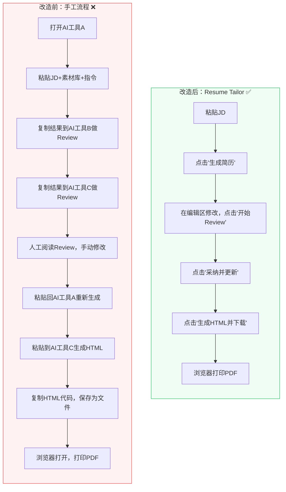
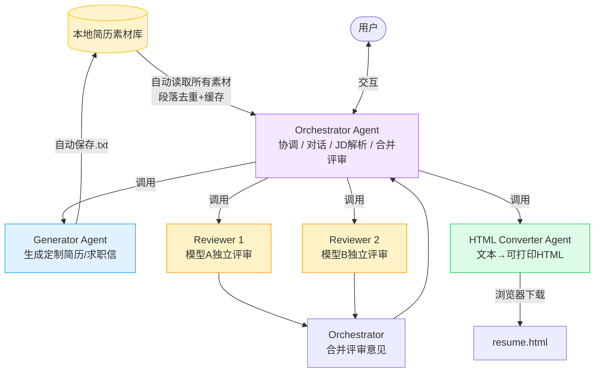
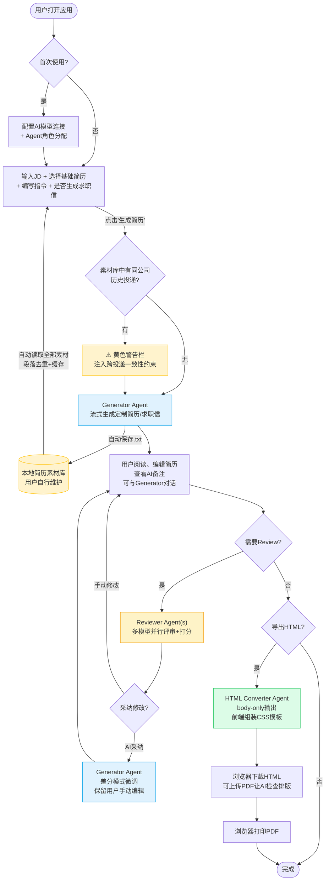
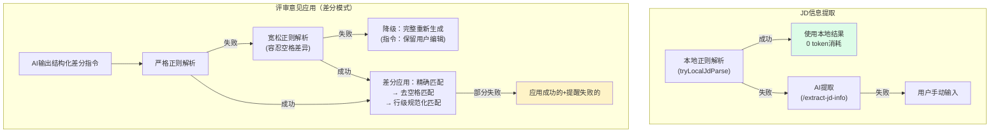
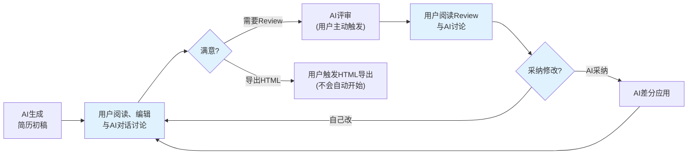
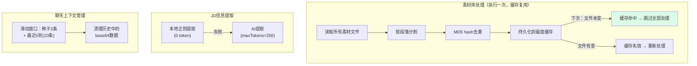
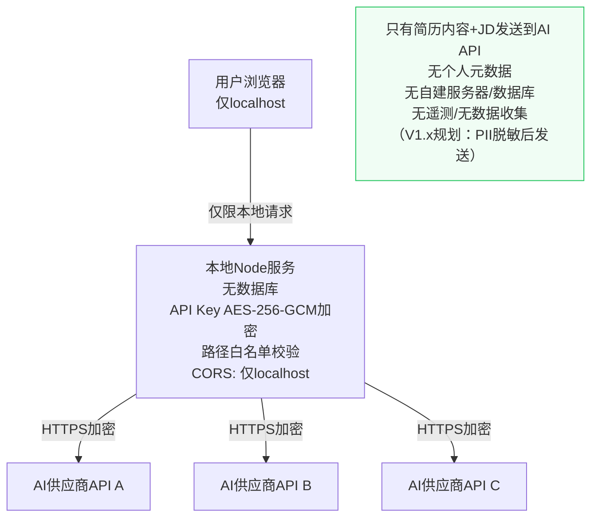
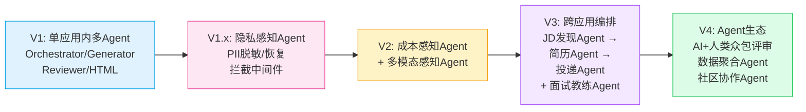

# Resume Tailor — AI多Agent简历定制助手

> 2026-04, wukun2005@gmail.com

[](LICENSE)


---

## 目录

1. [Executive Summary](#1-executive-summary)
2. [问题陈述与用户价值](#2-问题陈述与用户价值)
3. [核心功能：多Agent跨应用编排](#3-核心功能多agent跨应用编排)
4. [AI不确定性管理：约束、降级与护栏](#4-ai不确定性管理约束降级与护栏)
5. [Token成本优化战略](#5-token成本优化战略)
6. [使用场景](#6-使用场景)
7. [安全与隐私](#7-安全与隐私)
8. [产品路线图](#8-产品路线图)
9. [快速开始](#9-快速开始)
10. [术语表](#10-术语表)
11. [设计文档](./DESIGN.md)

---

## 1. Executive Summary

**Resume Tailor** 是一个本地运行的AI多Agent简历定制应用。它通过编排多个AI Agent（生成、评审、格式转换、协调），将求职者从"在多个AI工具之间反复复制粘贴"的45分钟手工流程，缩短为"一个应用、一条流水线"的15分钟自动化流程。

### 核心设计理念

| 原则 | 实现 |
|------|------|
| **隐私优先** | 纯本地运行，API Key用AES-256-GCM加密，简历内容不经过任何未授权第三方 |
| **Token经济** | 三阶段优化实现75-87% input + 52% output token节省，仿真模式零成本验证流程 |
| **不卡机器** | Node.js限制512MB内存，适配老款笔记本（四核i7/16GB） |
| **朴素UI** | 无动画、无渐变、无视觉特效，功能优先 |
| **一键启动** | `npm run dev` → 打开浏览器 → 开始工作 |

### 产品边界

| Resume Tailor 做什么 | 不做什么 |
|---------------------|----------|
| 根据JD自动生成定制简历和求职信 | HTML→PDF转换（用户在浏览器手动打印） |
| 多模型并行评审并打分 | 管理素材库内容本身 |
| 跨投递一致性自动检查 | 自动投递简历（V3规划） |
| 多轮AI辅助编辑（带上下文记忆） | ATS评分预测 |
| 导出可打印的HTML文件 | 简历模板市场 |
| 灵活配置多供应商AI模型 | 长期职业规划 |

---

## 2. 问题陈述与用户价值

### 2.1 用户画像

| 维度 | 描述 |
|------|------|
| 身份 | 有技术背景的求职者，能使用命令行 |
| 设备 | macOS笔记本（包括较老的硬件） |
| AI获取方式 | 付费API代理平台和/或免费大模型平台 |
| 简历习惯 | 维护本地素材库文件夹，按JD定制简历 |
| 预算敏感度 | 高度关注AI token成本——每一分钱都重要 |

### 2.2 用户痛点

| # | 痛点 | 影响 |
|---|------|------|
| 1 | **多工具切换**：在多个AI聊天工具之间反复复制粘贴JD、素材库、指令 | 每份简历浪费30+分钟 |
| 2 | **上下文丢失**：多轮编辑中AI忘记之前的修改上下文 | 修改前后不一致 |
| 3 | **版本管理混乱**：向同一公司投递多个职位时，简历之间出现事实矛盾（Title不一致、年份冲突） | HR直接拉黑 |
| 4 | **质量无保障**：单一AI生成无法多维度交叉评审 | 关键词堆砌、过度包装难以发现 |
| 5 | **成本不可控**：不知道一次简历定制要花多少token，用完才知道花了多少钱 | 预算焦虑 |

### 2.3 工作流对比：Before vs. After



**关键改善**：
- **步骤**：3个工具×9步手动操作 → 1个应用×6次点击
- **上下文**：每次重新输入 → 自动管理（素材库、JD、指令、对话历史全部自动维护）
- **一致性**：无 → 自动检测同公司历史投递并注入事实约束

### 2.4 成功指标

| 指标 | 衡量方式 | 目标 |
|------|---------|------|
| 端到端耗时 | 从粘贴JD到导出PDF | < 15分钟（原45+分钟） |
| 人工修改比例 | AI输出中需要人工修改的占比 | < 20% |

---

## 3. 核心功能：多Agent跨应用编排

### 3.1 为什么要做多Agent编排？

传统的"一个AI聊天窗口包办一切"有三个根本问题：

1. **角色冲突**：让同一个AI既生成简历又评审自己的作品，相当于让作者当自己的编辑——它倾向于认可自己的输出
2. **模型局限**：不同AI模型各有所长——有的擅长写作，有的擅长挑错，有的性价比高——单一模型无法覆盖所有需求
3. **用户失控**：一个黑盒流程中，用户无法在关键节点介入审查和修改

多Agent编排的解决思路是 **拆分职责、各专其能、用户掌控关键决策点**：



### 3.2 四个Agent的职责分工

| Agent | 职责 | 推荐模型选择 | 理由 |
|-------|------|------------|------|
| **Orchestrator** | 用户对话、JD解析、多评审合并、流程协调 | 旗舰推理模型 | 需要最强推理能力来协调全局 |
| **Generator** | 根据JD+素材库+指令生成定制简历和求职信 | 旗舰推理模型 | 需要最高写作质量 |
| **Reviewer × N** | 独立评审+打分（支持多个模型并行） | 多种模型混搭 | 多模型交叉评审降低偏见 |
| **HTML Converter** | 纯文本→可打印HTML排版 | 免费/轻量模型 | 简单任务用低成本模型 |

### 3.3 编排的核心价值

| 设计决策 | 解决的问题 | 对用户的好处 |
|---------|-----------|------------|
| 生成与评审分离 | 消除"自己评审自己"的偏见 | 获得真正独立的第三方意见 |
| 多模型并行评审 | 单一模型的盲点和偏见 | 交叉验证，发现更多问题 |
| 每个Agent可配置不同模型 | 成本vs质量的权衡 | 关键环节用好模型，简单环节用免费模型 |
| 用户在每个环节可介入 | AI自动化的不可控性 | 用户始终掌握最终决定权 |
| 差分模式（Diff）应用修改 | 全量重生成破坏用户手动编辑 | 保留用户每一处手动修改 |

### 3.4 两级模型配置系统

用户可以灵活混搭不同AI供应商的不同模型：

**第一级：模型连接** — 配置供应商的API凭证

| 接入类型 | 定价 | 可用模型范围 |
|----------|------|-------------|
| 付费API代理平台 | 按量付费 | 多家供应商的各类模型（推理模型/生成模型/轻量模型等） |
| 免费大模型平台 | 免费（有限额，部分地区需VPN） | 该供应商自有模型 |

> 应用采用**供应商无关架构**：通过统一的SDK路由层，自动根据连接类型选择对应的原生SDK或兼容协议调用，用户无需关心底层协议差异。

**第二级：Agent角色分配** — 为每个Agent选择使用哪个连接

```
┌── 模型连接配置 ────────────────────────────┐
│  ▼ 付费API代理平台A                        │
│  ┌──────────┬────────┬────────┬──────────┐ │
│  │模型类型   │ URL    │ Key    │ Model ID │ │
│  ├──────────┼────────┼────────┼──────────┤ │
│  │供应商X    │ ...    │ ****** │ model-x  │ │
│  │供应商Y    │ ...    │ ****** │ model-y  │ │
│  └──────────┴────────┴────────┴──────────┘ │
│  ▸ 付费API代理平台B [点击展开]              │
│  ▸ 免费大模型平台 [点击展开]                │
├── Agent角色分配 ──────────────────────────── ┤
│  Orchestrator  [代理平台A - 供应商X ▼]      │
│  Generator     [代理平台A - 供应商X ▼]      │
│  Reviewer      ☑ 代理平台A-Y ☑ 免费平台    │
│  HTML Converter[免费大模型平台 ▼]           │
│                          [保存并连接]       │
└────────────────────────────────────────────┘
```

### 3.5 完整应用工作流



### 3.6 UI布局

```
┌──────────────────────────────────────────────────┐
│  Header: [简历定制助手]     [仿真模式 ☐]  [设置]  │
├──────────────────────────────────────────────────┤
│  输入区                                           │
│  ├── JD输入框                                     │
│  ├── 素材库路径 + [浏览] [加载]                     │
│  ├── 基础简历下拉选择                               │
│  ├── [▸ 生成指令] (可折叠)                          │
│  ├── [▸ HTML格式指令] (可折叠)                      │
│  └── [☐ 同时生成求职信]  [生成简历]                  │
├──────────────────────────────────────────────────┤
│  输出区（始终可见，可跳步操作）                        │
│  ┌────────────────────┬──────────────────────┐    │
│  │ 简历/求职信编辑区     │ Review面板           │    │
│  │ [保存] [重新生成]     │ [开始Review]         │    │
│  │                      │ [采纳并更新简历]      │    │
│  │ ┌──────────────────┐ │ ┌──────────────────┐│    │
│  │ │ 简历编辑器        │ │ │ Review结果       ││    │
│  │ │ (可直接编辑)      │ │ │ (可编辑)         ││    │
│  │ └──────────────────┘ │ └──────────────────┘│    │
│  │ ▸ AI备注 (折叠)      │                      │    │
│  │ Generator对话        │ Review对话           │    │
│  └────────────────────┴──────────────────────┘    │
│  ┌──────────────────────────────────────────┐     │
│  │ [生成HTML并下载]                           │     │
│  │ HTML对话 (支持上传PDF调试排版)              │     │
│  └──────────────────────────────────────────┘     │
└──────────────────────────────────────────────────┘
```

**关键交互设计**：
- 输出区**始终可见**——用户可以跳步操作（直接粘贴已有简历去Review，或直接导出HTML）
- 简历编辑区和Review面板**左右并排**，方便对比阅读和编辑
- 每个功能区都有**独立的AI对话框**，用户可以就该环节的问题与AI讨论
- AI备注**与简历正文分离**显示，不会污染编辑区

---

## 4. AI不确定性管理：约束、降级与护栏

> 构建AI-Native产品的核心挑战：AI的输出是概率性的，不是确定性的。本节记录Resume Tailor如何在系统层面管理AI的不确定性。

### 4.1 约束层（System Constraints）— 限定AI行为边界

| 约束 | 应用场景 | 实现方式 |
|------|---------|---------|
| **结构化输出格式** | 简历生成 | 强制三段式分隔符（`===== 简历正文 =====` / `===== AI备注 =====`），前端解析器拒绝不合格输出 |
| **事实诚实性硬约束** | 生成+评审 | Prompt注入："必须诚实，不得编造经历、数据或证书" |
| **跨投递一致性约束** | 同公司多次投递 | 分层规则：事实层锁定（Title/时间线/数据必须一致），表达层灵活（侧重点可调） |
| **篇幅限制** | 生成+HTML | "必须在2页A4内" |
| **输出token上限** | 每条API路由 | 按路由校准：JD解析=256, 评审=3072, 生成=8192，防止AI过度输出 |
| **Body-only HTML** | HTML生成 | AI只输出`<body>`内HTML，系统用预置CSS模板组装完整文档 |

### 4.2 降级层（Fallbacks）— AI失败时的优雅退化



**差分匹配三层容错的设计意义**：AI输出的修改指令（"把A改成B"）中的"A"经常和原文有微小差异（多余空格、换行不一致等）。三层匹配确保即使AI不够精确，修改也不会静默丢失：

| 层级 | 匹配策略 | 容忍的差异 |
|------|---------|-----------|
| 第1层 | 精确字符串匹配 | 无 |
| 第2层 | 去除首尾空格后匹配 | 空格、制表符 |
| 第3层 | 按行规范化后匹配 | 换行符、行内多余空格 |
| 最终降级 | 完整重新生成 | 所有（但保留用户编辑指令） |

### 4.3 护栏层（Guardrails）— 防止有害输出

| 风险 | 护栏 |
|------|------|
| **编造经历/数据** | Prompt硬约束 + Review明确检查项："是否存在原始素材中不支持的声明？" |
| **同公司简历矛盾** | 自动检测历史投递 → 注入分层一致性约束 → Review追加跨投递检查维度 |
| **关键词堆砌** | Review检查项："是否存在不自然的关键词堆砌？" |
| **过度包装** | Review检查项："诚实度与过度包装检测——标记无法被原始素材支持的声明" |
| **破坏用户编辑** | 差分模式（AI只输出修改指令而非全量重写） + Prompt指令"保留所有用户手动编辑" |
| **AI成本失控** | 每路由maxTokens上限 + 仿真模式 + 聊天历史滑动窗口 + 历史base64清理 |

### 4.4 人在回路（Human-in-the-Loop）设计

Resume Tailor遵循的原则：**AI提议，人做决定**。



**一切操作由用户主动触发**：
- Review不会在生成后自动开始——用户点击"开始Review"
- HTML导出不会自动开始——用户点击"生成HTML并下载"
- 采纳修改不会自动应用——用户点击"采纳并更新简历"

---

## 5. Token成本优化战略

> 核心策略：**不变的上下文预处理一次、持久化缓存、后续直接复用。能本地处理的，不用AI。**

### 5.1 优化效果总览

| 阶段 | 优化方向 | 效果 |
|------|---------|------|
| 第一阶段：Input token | 素材库去重缓存、本地JD解析、供应商Prompt Caching | **75-87% 节省** |
| 第二阶段：Output token | 差分模式、精简prompt、Body-only HTML | **52% 节省** |
| 第三阶段：审计 | 缓存标记优化、CSS精简、差分鲁棒性 | 额外缓存收益 |

### 5.2 Input Token优化策略



| 策略 | 节省 |
|------|------|
| 素材库段落级MD5去重 + 磁盘缓存 | 缓存命中时100%，首次30-60% |
| 本地JD解析（正则提取公司/部门/职位） | 每次~1600 token |
| 供应商Prompt Caching（利用部分供应商API的缓存特性，对重复发送的大块内容标记缓存控制标识，服务端缓存后续请求该部分大幅降低费用） | 缓存命中时90% |
| 聊天历史滑动窗口 + base64清理 | 上限控制在~20K |
| PDF用本地Poppler `pdftotext`提取（非AI OCR） | 远低于AI解析成本 |

### 5.3 Output Token优化策略

| 策略 | 节省 |
|------|------|
| 差分模式应用评审：AI输出`[REPLACE]<<<旧文本>>>新文本[/REPLACE]`而非全量重写 | **79%** |
| Body-only HTML：AI只输出`<body>`内容，前端组装完整文档 | **30%** |
| 多模型评审精简格式：每个Reviewer只输出评分+5条问题+5条建议 | **54%** |
| 按路由校准maxTokens上限 | 防止浪费 |
| 聊天分型system prompt（review/generator/html各不同） | **33%** |

---

## 6. 使用场景

### 场景1：首次投递一份新职位

用户拿到JD → 粘贴JD到输入框 → 选择基础简历 → 加载素材库 → 点击"生成简历" → AI流式生成定制简历/求职信 → 用户编辑 → 点击"开始Review" → AI多模型评审打分 → 点击"采纳并更新" → 满意后点击"生成HTML并下载" → 浏览器打印PDF → 完成。

### 场景2：向同一公司投递第二个职位

用户为某公司A部门的高级产品经理职位生成简历后，又要为该公司B部门的资深产品经理投递。系统自动检测到素材库中已有该公司的历史投递，显示黄色警告"⚠️ 检测到已向[该公司]投递过1份简历/求职信"，并自动在生成和评审的prompt中注入一致性约束——确保Title/时间线/项目数据与上一份完全一致，但Summary/技能排序/项目侧重可以根据新JD调整。

### 场景3：迭代优化

用户对AI生成的简历不完全满意 → 在编辑区手动修改几处表述 → 点击"开始Review"对修改后的版本重新评审 → 阅读评审意见 → 点击"采纳并更新"（AI用差分模式微调，保留用户的手动修改） → 再次编辑 → 满意后导出。

### 场景4：仅格式转换

用户已经有一份满意的txt格式简历（可能是在其他工具中写好的）→ 直接粘贴到简历编辑区 → 跳过"生成"和"Review"步骤 → 直接点击"生成HTML并下载" → 浏览器打印PDF。

---

## 7. 安全与隐私



| 威胁面 | 防护措施 |
|--------|---------|
| API Key泄漏 | AES-256-GCM加密 + PBKDF2密钥派生（10万次迭代），基于浏览器指纹 |
| 简历内容泄漏 | 纯本地运行，无云存储、无遥测、除AI API外不发送到任何第三方 |
| PII泄漏 | V1.x规划：姓名/电话/邮箱等PII在发送AI API前自动替换为占位符，返回后自动恢复（详见[路线图](#8-产品路线图)） |
| 路径遍历攻击 | 服务端`allowedDirs`白名单 + `path.resolve()`前缀校验 |
| CORS攻击 | 严格限制origin：仅`localhost`和`127.0.0.1` |
| Shell注入 | PDF解析使用`execFile`（非`exec`），无shell插值 |

---

## 8. 产品路线图

### V1（当前版本）：单应用内的多Agent编排

多Agent协作（Orchestrator/Generator/Reviewer/HTML Converter）在一个本地应用内完成简历定制全流程。**已完成并上线。**

### V1.x：PII脱敏保护（最高优先级）

**产品设计动机**：当前简历内容（含姓名、电话、邮箱等PII）直接发送给AI API，即使传输链路加密，仍存在供应商日志泄露的风险。这是产品层面的隐私Guardrails——在AI调用链路中设置不可逾越的PII边界。

- **发送前**：自动识别并替换PII为占位符（如 `[姓名]`、`[电话]`、`[邮箱]`），脱敏后的内容才发送给AI API
- **返回后**：AI生成的简历中自动将占位符恢复为真实PII，展示给用户
- **PII映射表仅存储在本地**，绝不发送给任何外部API
- **价值**：即使AI供应商的日志被泄露，攻击者也无法还原用户真实身份信息
- **架构影响**：作为V1增量更新，不改变现有架构，仅在API调用层增加拦截/恢复中间件

### V2：成本透明化与多模态素材

#### V2.1 Token预估与费用透明化

**产品设计动机**：这是AI不确定性管理的又一种Guardrails——在不确定的AI成本面前，给用户设置明确的预期和确认门槛。

- **生成前**：根据输入内容（JD长度 + 素材库大小 + 所选模型）预估本次定制的token消耗和对应费用，**用户确认后才开始**
- **生成后**：实时显示实际消耗的input/output token数量，按所选模型供应商单价折算实际费用
- **价值**：让用户对AI使用成本有完全的可预见性和控制权，消除"用完才知道花了多少"的焦虑

#### V2.2 多模态素材支持

- 支持图片（作品集/证书扫描）、视频（项目演示/自我介绍）、源代码（代码仓库/代码片段）、外部社交媒体内容（职业社交平台帖子/博客文章等）
- **价值**：从"文本简历素材"扩展到"全方位职业画像"，AI可以从更丰富的维度理解候选人

### V3：跨应用自动化编排与面试链路

#### V3.1 跨应用自动化编排

- Agent自动搜索网络上的相关JD → 根据JD自动生成定制简历 → 自动投递
- **价值**：从"用户主动找JD"演进到"系统主动发现+匹配+投递"
- **核心挑战**：JD来源多样（各类招聘网站/职业社交平台等）、投递流程差异大、反爬虫

#### V3.2 面试完整链路

- 基于JD自动生成面试问题库 + AI模拟面试官（多角色：技术面试官/HR/业务主管等）
- 实时反馈、答案优化建议、面试表现评分和改进追踪
- 众包评审：以AI模拟面试官为主 + human-in-the-loop人类众包点评
- **价值**：从"写好简历通过初筛"升级到"通过复试/终面"的完整求职链路

### V4：平台化 —— "简历灌篮高手"

- 多用户求职社区平台
- 用户注册和简历库管理
- 社区共享的JD库 + 投递数据
- 众包评审：以AI机器人评审为主 + human-in-the-loop人类众包评审
- 投递成功率排行榜（透明化求职竞争力）
- **价值**：从个人工具演进为求职生态，连接求职者、简历数据和市场反馈

### 核心设计理念：多Agent跨应用编排的演进



从V1到V4，产品的Agent编排在三个维度上持续拓展：

| 维度 | V1 | V1.x | V2 | V3 | V4 |
|------|----|----|----|----|-----|
| **Agent数量** | 4个 | +PII拦截层 | +成本/多模态Agent | +JD搜索/投递/面试Agent | +人类众包/社区Agent |
| **编排范围** | 单应用内 | 单应用内 | 单应用内 | 跨应用/跨网站 | 跨平台生态 |
| **人机协作** | 用户主导 | 用户主导 | 用户主导 | 半自动 | AI为主+人类众包 |

---

## 9. 快速开始

### 前置条件

- **Node.js** >= 18
- **Poppler**（用于素材库PDF文本提取）：`brew install poppler`
- 至少一个AI API Key（部分大模型平台提供免费额度）

### 安装与启动

```bash
git clone <本项目仓库URL>
cd resumeTailor/vscCCOpus
npm install
npm run dev
# 浏览器打开 http://localhost:5173
```

### 首次建议：仿真模式

1. 勾选页面顶部"仿真模式"
2. 按正常流程操作——所有AI输出为预设文本，零API成本
3. 验证工作流无问题后，取消勾选切换到真实AI

### 快速参考

| 我想... | 怎么做 |
|---------|--------|
| 跳过生成，直接Review | 把简历粘贴到编辑区 → 点击"开始Review" |
| 跳过Review，直接导出HTML | 编辑区有简历 → 点击"生成HTML并下载" |
| 更换AI模型 | 设置 → 修改Agent分配 → 保存 |

---

## 10. 术语表

| 术语 | 定义 |
|------|------|
| **JD** | Job Description，职位描述 |
| **素材库** | 用户本地文件夹，包含简历、求职信和职业素材。应用自动读取，用户自行维护 |
| **Agent** | 负责特定任务的AI角色（生成/评审/转换/协调） |
| **连接** | 一组已配置的API凭证（供应商 + URL + Key + Model ID） |
| **Orchestrator** | 协调Agent——处理对话、JD解析、评审合并 |
| **Generator** | 生成Agent——生成定制简历和求职信 |
| **Reviewer** | 评审Agent——评审简历并打分（支持多个并行） |
| **HTML Converter** | 转换Agent——将纯文本简历转为可打印HTML |
| **仿真模式** | 使用预设数据模拟完整工作流，不消耗API token |
| **Token** | AI API计费单位，与输入/输出文本长度成正比 |
| **跨投递一致性** | 自动检测同公司历史投递，注入事实一致性约束 |
| **差分模式** | 评审应用策略——AI输出`[REPLACE]`修改指令而非全量重写 |
| **素材库摘要** | 段落去重、缓存后的素材库内容压缩表示 |
| **PII脱敏** | 个人身份信息（姓名/电话/邮箱）在发送AI API前替换为占位符，返回后恢复 |

---

## License

MIT

---

> **设计文档**：实现细节、变更记录和开发者指南，请参阅 **[DESIGN.md](./DESIGN.md)**。
