# 简历定制助手 — 产品需求文档 (PRD)

> 2026-04, wukun2005@gmail.com

👉 **[点击这里查看项目的详细设计文档 (DESIGN.md)](./DESIGN.md)**

---

## 目录

1. [背景与痛点](#1-背景与痛点)
2. [产品定义](#2-产品定义)
3. [成功指标](#3-成功指标)
4. [用户画像](#4-用户画像)
5. [核心工作流](#5-核心工作流)
6. [功能说明](#6-功能说明)
7. [多模型配置系统](#7-多模型配置系统)
8. [使用指南](#8-使用指南)
9. [安全与隐私](#9-安全与隐私)
10. [技术约束与限制](#10-技术约束与限制)
11. [术语表](#11-术语表)

---

## 1. 背景与痛点

### 1.1 现状

求职者在针对不同岗位的 JD 定制简历时，需要在多个 AI 工具之间反复切换、复制粘贴：

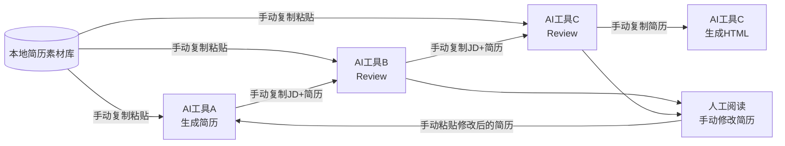

**痛点**：
- 每次定制一份简历需要在 3-4 个 AI 窗口之间来回复制粘贴
- JD + 简历素材库 + 指令文本量大，每次都要从素材库中手动复制重复输入
- 多轮修改时 AI 会丢失上下文，导致修改不连贯
- 生成的 HTML 需要手动从聊天记录中复制保存
- 没有统一的文件管理，生成的简历散落各处，没有回写到素材库

### 1.2 期望

**一个 APP，一个流程，从 JD 到 PDF。素材库自动读取，生成的文件自动回写。**

---

## 2. 产品定义

### 2.1 一句话描述

**简历定制助手**是一个本地运行的 Web 应用，用 AI 多 Agent 协作自动完成「JD → 定制简历/求职信 → 评审修改 → HTML 导出」全流程。

### 2.2 设计原则

| 原则 | 说明 |
|------|------|
| 隐私第一 | 纯本地运行，凭证加密存储，简历内容不经过无关第三方 |
| 省 Token | Mock 模式先测流程；HTML→PDF 用户手动完成；无预览消耗 |
| 不卡机器 | Node.js 内存上限 512MB，适配老款笔记本 |
| 朴素 UI | 没有动画/渐变/流光效果，功能优先 |
| 一键启动 | `npm run dev` + 打开浏览器即可使用 |

### 2.3 产品边界

| 简历定制助手负责 | 不负责 |
|-----------------|--------|
| 自动读取本地简历素材库，作为生成/评审的事实基础 | HTML → PDF 转换（用户在浏览器手动打印） |
| 根据 JD 生成定制简历和求职信 | 简历素材库内容管理（用户自行维护本地文件夹） |
| 多 AI 模型并行评审 | |
| 与 AI 多轮对话修改简历 | |
| 简历 → HTML 格式转换 | |
| 生成的文件自动命名并保存回素材库 | |
| 多供应商 AI 模型配置 | |
| 跨投递一致性检查：同公司多次投递自动约束事实一致 | |

---

## 3. 成功指标

| 指标 | 衡量方式 | 当前状态 |
|------|---------|---------|
| **端到端生成时间** | 从粘贴 JD 到拿到可投递终稿的耗时 | 可衡量（人工计时） |
| **手动修改幅度** | AI 输出终稿后，用户还需手动修改的比例 | 可衡量（人工判断） |
| **面试转化率** | 通过简历筛查获得面试机会的比例 | 终极 business value；目前无法由 APP 自动衡量，需用户自行跟踪 |

---

## 4. 用户画像

| 维度 | 描述 |
|------|------|
| 身份 | 求职者，有一定技术背景，能使用命令行 |
| 设备 | macOS 笔记本 |
| AI 工具 | 付费 AI API 代理（如 Jiekou.ai、OpenRouter.ai）和/或免费 Google AI Studio |
| 简历习惯 | 维护一个本地简历素材库文件夹，每次投递不同岗位时定制简历 |
| 核心诉求 | 减少重复性复制粘贴操作，一站式完成简历定制全流程 |

---

## 5. 核心工作流

### 5.1 端到端流程

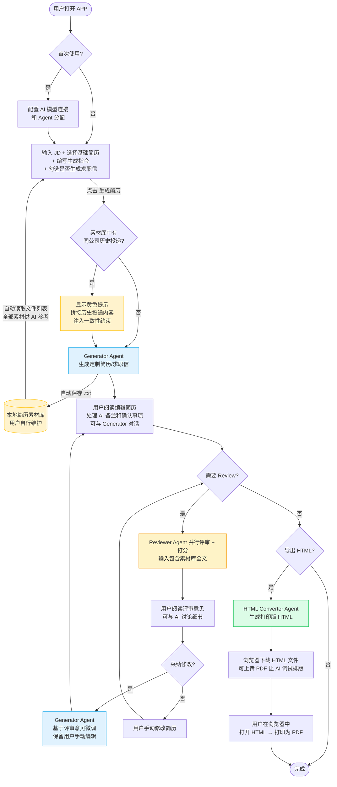

### 5.2 多 Agent 协作

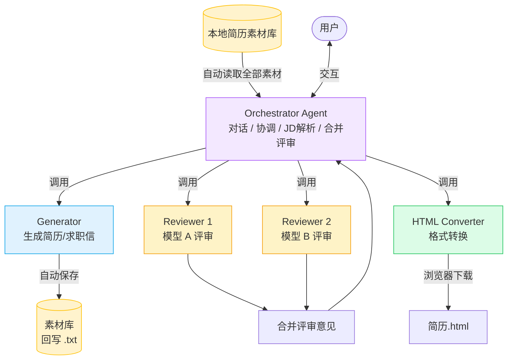

每个 Agent 可以分配不同的 AI 模型，例如：
- Generator = Claude Opus 4.6（高质量生成）
- Reviewer 1 = Gemini 2.5 Flash（快速免费）
- Reviewer 2 = GPT-4o（多样视角）
- HTML Converter = Gemini 2.5 Flash（简单任务用免费模型）

### 5.3 数据流

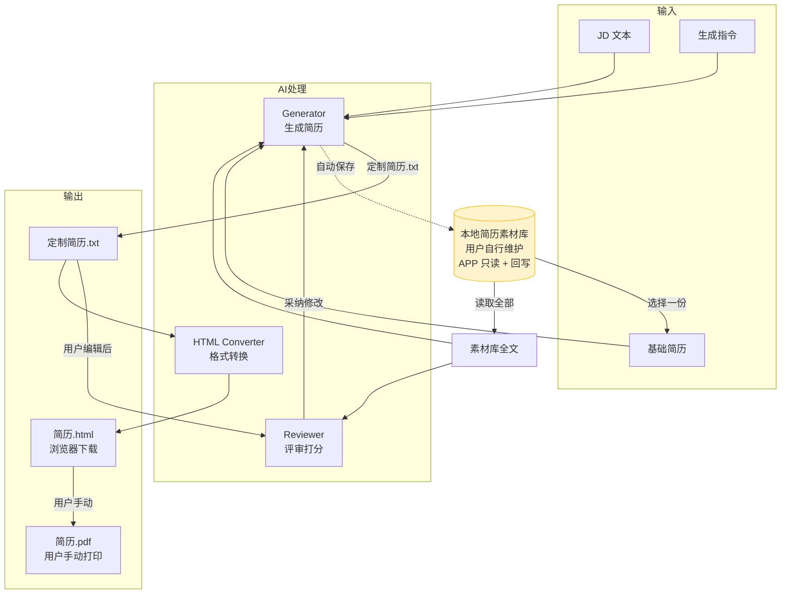

---

## 6. 功能说明

### 6.1 功能一览

| # | 功能 | 触发方式 | 说明 |
|---|------|---------|------|
| F1 | AI 模型配置 | 点击「设置」按钮 | 配置供应商连接 + Agent 角色分配 |
| F2 | 素材库加载 | 输入路径 + 点击「加载」 | 自动读取本地文件夹中的所有素材 |
| F3 | 简历生成 | 点击「生成简历」 | AI 根据 JD + 基础简历 + 素材库生成定制简历/求职信 |
| F4 | AI 备注与对话 | 生成后自动显示 | 查看 AI 分析、回答确认事项 |
| F5 | 简历评审 | 点击「开始 Review」 | 一个或多个 AI 模型并行评审 |
| F6 | 采纳修改 | 点击「采纳并更新简历」 | AI 基于评审意见微调（保留用户手动编辑） |
| F7 | Review 对话 | 在 Review 区聊天框 | 与 AI 讨论评审细节 |
| F8 | HTML 导出 | 点击「生成 HTML 并下载」 | 生成打印版 HTML 并触发浏览器下载 |
| F9 | HTML 调试对话 | 在 HTML 区聊天框 | 上传 PDF 让 AI 看排版问题并修复 |
| F10 | 自动保存 | 生成后自动执行 | AI 根据 JD 自动命名文件并保存回素材库 |
| F11 | 仿真模式 | 勾选「仿真模式」 | 模拟全流程，不消耗 Token |
| F12 | 跨投递一致性检查 | 生成/评审时自动触发 | 检测同公司历史投递，注入一致性约束防止事实矛盾 |

### 6.2 功能详细说明

#### F1 — AI 模型配置

两级配置：先配连接，再分配 Agent。

```
设置弹窗布局：

┌── 模型连接配置 ──────────────────────────────────┐
│                                                  │
│  ▼ Jiekou.ai（付费代理）                          │
│  ┌────────┬────────────────┬──────────┬────────┐ │
│  │模型类型 │ API URL        │ API Key  │Model ID│ │
│  ├────────┼────────────────┼──────────┼────────┤ │
│  │OpenAI  │api.jiekou.ai/v1│ ******** │ gpt-4o │ │
│  │Google  │api.jiekou.ai/v1│ ******** │ gem... │ │
│  │Anthro  │.../anthropic   │ ******** │ opus.. │ │
│  └────────┴────────────────┴──────────┴────────┘ │
│                                                  │
│  ▶ OpenRouter.ai（付费代理）[点击展开]             │
│  ▶ Google AI Studio（免费直连 — 需 VPN）[点击展开] │
│                                                  │
├── Agent 模型分配 ────────────────────────────────┤
│  (下拉选项从上方已配置的连接中自动生成)              │
│                                                  │
│  Orchestrator   [Jiekou Anthropic (opus-4-6) ▼]  │
│  Generator      [Jiekou Anthropic (opus-4-6) ▼]  │
│  Reviewer       ☑ Jiekou Google  ☑ Google Studio │
│  HTML Converter [Google AI Studio (flash)    ▼]  │
│                                                  │
│                            [保存并连接]           │
└──────────────────────────────────────────────────┘
```

**配置逻辑**：
1. 用户在上方表格中填写 API Key 和 Model ID
2. 下方 Agent 分配区自动出现已配置的连接作为选项
3. 点击「保存并连接」→ 加密保存凭证 + 测试连接

#### F2 — 素材库加载

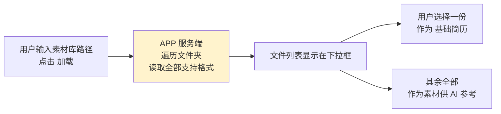

支持格式：`.txt` `.html` `.pdf` `.docx`（`.pages` 提示手动粘贴）

素材库的路径持久化保存，下次打开 APP 自动加载。素材库由用户自行维护，APP 每次使用时重新读取最新内容。

#### F3 — 简历生成

AI 输出强制三段式结构，前端自动解析分离：

```
===== 简历正文 =====          ──┐
[候选人姓名]                    │ → 显示在「简历编辑区」
Senior Product Manager          │    用户可直接编辑
...                            ─┘

===== 求职信正文 =====        ──┐
尊敬的招聘经理：                 │ → 也显示在「简历编辑区」
...                            ─┘    （如果勾选了生成求职信）

===== AI备注 =====            ──┐
分析策略：...                    │ → 显示在折叠的「AI备注」区
需要确认：...                    │    不污染简历编辑区
...                            ─┘
```

#### F5 — 简历评审（支持多模型）

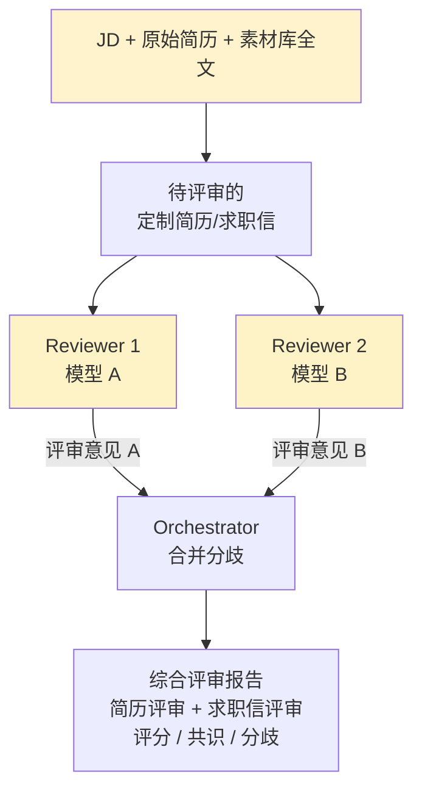

评审维度：
- 与原始简历的事实一致性
- 篇幅是否控制在 2 页 A4
- JD 关键词堆砌检测
- 核心经历深度是否足够
- 诚实度与过度包装检测
- 数字一致性

#### F6 — 采纳修改

关键设计：**保留用户的手动编辑**

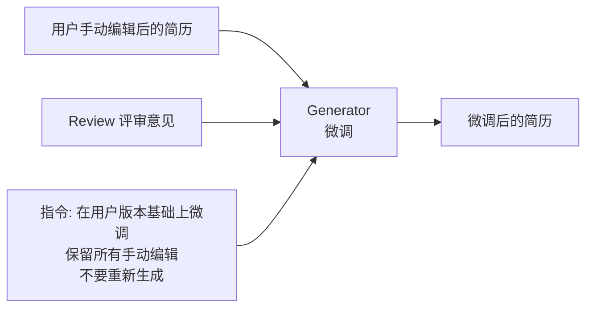

#### F9 — HTML 调试对话

```
用户：[上传打印出的 PDF]  页脚被截断了，第二页太空

  AI：看到了，第一页的 margin-bottom 太大导致内容溢出，
      第二页空白是因为 page-break 位置不对。
      已修正，下载更新版 HTML：

  [浏览器自动下载 更新版.html]
```

#### F10 — 自动文件命名

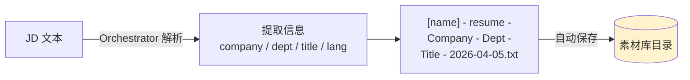

命名规则：
- 中文 JD → 中文公司名/职位名
- 英文 JD → 英文公司名/职位名
- 日期 = 生成当天

#### F12 — 跨投递一致性检查

当用户为某公司生成简历时，系统自动扫描素材库，检测是否存在之前向**同一公司**投递过的简历或求职信。如果存在，将这些历史投递作为上下文传递给 AI，并注入分层一致性约束规则。

**检测流程**：

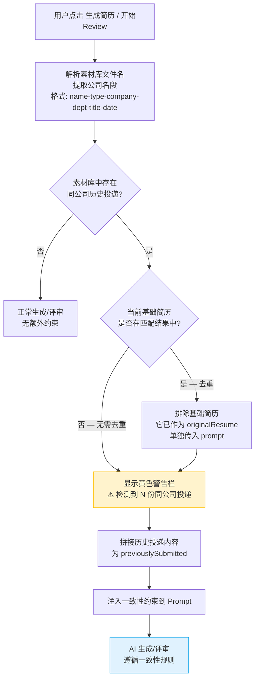

**基础简历排除逻辑说明**：

系统会排除当前选中的基础简历，避免它同时出现在 `originalResume` 和 `previouslySubmitted` 两个 prompt 段落中造成重复。两种典型场景：

| 场景 | 基础简历 | 排除是否触发 | 说明 |
|------|---------|------------|------|
| A — 最常见 | 通用主简历（如 `base-resume.txt`） | 不触发 | 文件名不含公司名，不会匹配到检索结果中。所有同公司历史投递完整进入 `previouslySubmitted`。AI 参考原始事实 + 所有历史投递生成新简历 |
| B | 某份已投递的同公司简历 | 触发 | 该文件已作为 `originalResume` 传入，排除避免重复。其余同公司投递正常进入 `previouslySubmitted`，AI 不会遗漏任何信息 |

**一致性约束分层**：

| 层级 | 规则 | 可否调整 |
|------|------|---------|
| 事实层 | 时间线、Title、公司名、项目名、数据指标、专利/论文、教育背景 | 必须完全一致 |
| 事实层 | 技能列表 | 不能凭空新增之前未出现过的技能 |
| 表达层 | Summary/Skills 排列顺序、项目要点侧重角度、关键词选择 | 可按目标岗位灵活调整 |

**最终效果**：在 HR 眼中，同一公司的多份投递看起来是「同一份经历的两个不同侧面」，而非前后矛盾的两份简历。

---

## 7. 多模型配置系统

### 7.1 支持的供应商

| 供应商 | 计费 | 可用模型族 | 网络要求 |
|--------|------|-----------|---------|
| Jiekou.ai | 付费 | OpenAI / Google / Anthropic | 无 |
| OpenRouter.ai | 付费 | OpenAI / Google / Anthropic | 无 |
| Google AI Studio | 免费 | Google | 需VPN |

### 7.2 SDK 路由

不同的连接走不同的 SDK，用户无需关心：

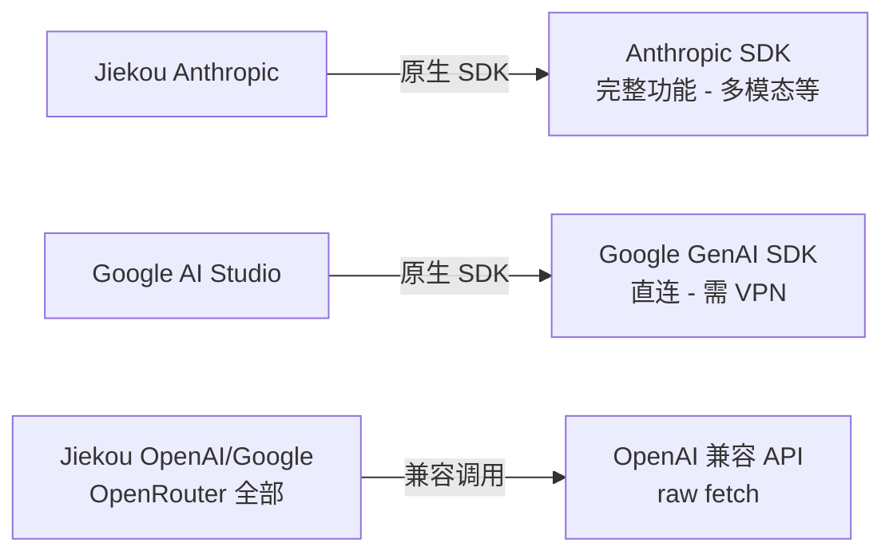

### 7.3 推荐配置方案

**方案一：最低成本（全免费）**
| Agent | 连接 | 模型 | 成本 |
|-------|------|------|------|
| Orchestrator | Google AI Studio | gemini-2.5-flash | 免费 |
| Generator | Google AI Studio | gemini-2.5-flash | 免费 |
| Reviewer | Google AI Studio | gemini-2.5-flash | 免费 |
| HTML Converter | Google AI Studio | gemini-2.5-flash | 免费 |

**方案二：质量优先**
| Agent | 连接 | 模型 | 成本 |
|-------|------|------|------|
| Orchestrator | Jiekou Anthropic | claude-opus-4-6 | 付费 |
| Generator | Jiekou Anthropic | claude-opus-4-6 | 付费 |
| Reviewer x2 | Jiekou Google + Google Studio | gemini-2.5-pro + flash | 混合 |
| HTML Converter | Google AI Studio | gemini-2.5-flash | 免费 |

**方案三：多样评审**
| Agent | 连接 | 模型 | 成本 |
|-------|------|------|------|
| Orchestrator | Jiekou Anthropic | claude-opus-4-6 | 付费 |
| Generator | Jiekou Anthropic | claude-opus-4-6 | 付费 |
| Reviewer x3 | Jiekou OpenAI + Jiekou Google + Google Studio | gpt-4o + gemini-2.5-pro + flash | 混合 |
| HTML Converter | Google AI Studio | gemini-2.5-flash | 免费 |

---

## 8. 使用指南

### 8.1 安装与启动

```bash
# 1. 进入项目目录
cd <项目目录>

# 2. 安装依赖（仅首次）
npm install

# 3. 启动应用
npm run dev

# 4. 浏览器打开
open http://localhost:5173
```

停止应用：在终端按 `Ctrl+C`

### 8.2 首次配置

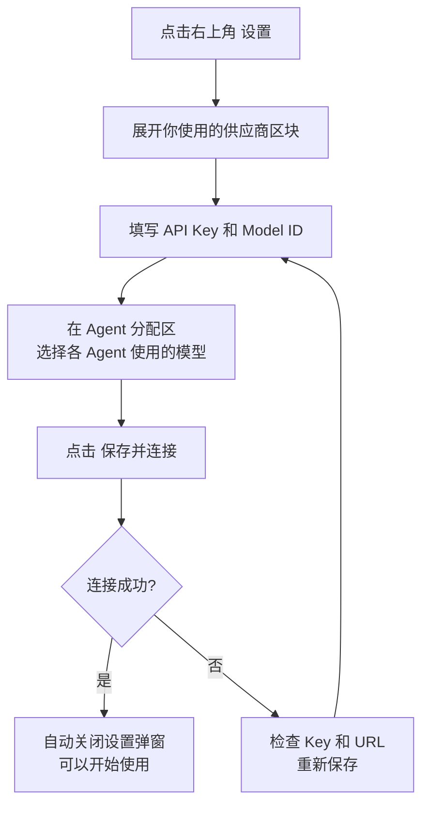

### 8.3 标准使用流程

#### 第一步：准备输入

1. 在「职位描述 (JD)」框中粘贴目标岗位的 JD
2. 在「简历素材库路径」中输入素材库文件夹的本地绝对路径，点击「加载」
3. 在「基础简历」下拉框中选择一份基础简历（APP 会自动读取素材库全部内容供 AI 参考）
4. （可选）展开「生成指令」编辑框，填写特殊要求
5. （可选）勾选「同时生成求职信」

#### 第二步：生成简历

1. 点击「生成简历」按钮
2. 等待 AI 流式输出完成（简历自动保存到素材库）
3. 阅读生成的简历，直接在编辑区修改
4. 如果有 AI 备注，展开查看并在对话框中回答确认事项

#### 第三步：评审

1. 点击「开始 Review」
2. 阅读评审意见和评分（简历和求职信分别评审）
3. 选择：
   - 点击「采纳并更新简历」让 AI 自动微调（保留你的手动编辑）
   - 或自己手动修改后再次 Review
4. 可在 Review 对话框中与 AI 讨论细节

#### 第四步：HTML 导出

1. 确认简历满意后，点击「生成 HTML 并下载」
2. 浏览器下载栏弹出 HTML 文件
3. 点击下载的文件在浏览器中预览
4. `Cmd + P` 打印为 PDF（HTML 的 `<title>` 已设为文件名，PDF 自动使用此名称）
5. 如果排版有问题，在 HTML 对话框中上传 PDF 让 AI 修复

### 8.4 仿真模式（Mock Mode）

首次使用建议先用仿真模式跑通流程：

1. 勾选右上角「仿真模式」
2. 按正常流程操作（无需配置 API Key）
3. 所有 AI 输出都是预设文本，不消耗 Token
4. 确认流程无误后，取消勾选即可切换到真实模式

### 8.5 常见操作速查

| 我想要... | 怎么做 |
|-----------|--------|
| 跳过生成，直接 Review 已有简历 | 直接在编辑区粘贴简历，点击「开始 Review」 |
| 跳过 Review，直接导出 HTML | 编辑区有内容即可点击「生成 HTML 并下载」 |
| 重新生成简历 | 点击「重新生成」按钮 |
| 手动保存当前简历 | 点击「保存到素材库」，可修改文件名 |
| 更换 AI 模型 | 设置 → 修改 Agent 分配 → 保存并连接 |
| 修改 HTML 格式要求 | 展开「HTML 格式指令」编辑框 |
| `.pages` 文件无法读取 | 在系统弹出的手动输入框中粘贴内容 |

---

## 9. 安全与隐私

### 9.1 架构

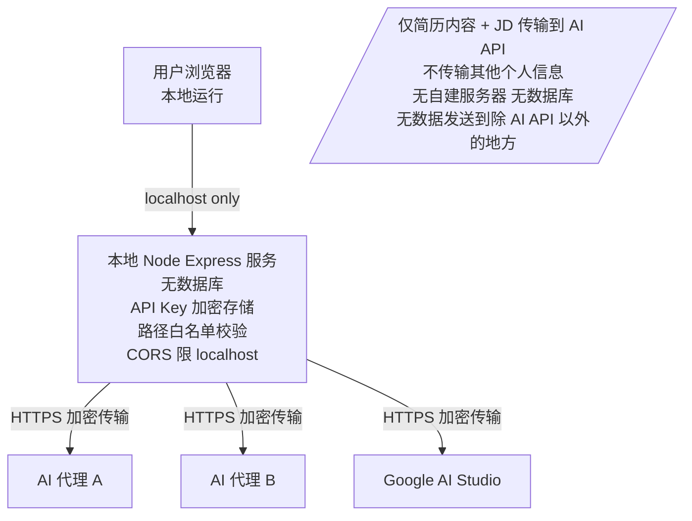

### 9.2 具体措施

| 保护对象 | 措施 |
|----------|------|
| API Key | AES-256-GCM 加密后存入浏览器 localStorage |
| 简历内容 | 不存云端，不经过非 AI API 的第三方 |
| 文件系统 | 服务端路径白名单校验，防止目录遍历攻击 |
| 网络请求 | CORS 仅允许 localhost 源 |
| 源代码 | 纯本地运行，无远程依赖 |

---

## 10. 技术约束与限制

| 约束 | 说明 | 影响 |
|------|------|------|
| 系统依赖 | 需预装 Poppler（`brew install poppler`）用于 PDF 文本提取 | 未安装时无法读取素材库中的 PDF 文件 |
| 内存限制 | Node.js 限制 512MB | 防止老设备卡死 |
| `.pages` 文件 | Apple 专有格式无法解析 | 提示用户手动粘贴 |
| Google AI Studio | 需要 VPN（中国大陆） | 直连时需开启 VPN |
| Gemini 2.5 Pro | 免费额度可能为 0 | 默认使用 2.5 Flash |
| PDF 多模态 | OpenAI 兼容 API 不支持 PDF 上传 | HTML调试对话中仅 Anthropic/Google 模型支持上传PDF |
| 浏览器依赖 | 凭证存在 localStorage | 换浏览器需重新配置 |
| 打印 PDF | 不同浏览器打印效果略有差异 | 推荐使用 Chrome |

---

## 11. 术语表

| 术语 | 说明 |
|------|------|
| JD | Job Description，职位描述 |
| 简历素材库 | 用户本地维护的文件夹，包含多份简历和求职相关素材，APP 自动读取 |
| Agent | 负责特定任务的 AI 角色（生成/评审/转换/协调） |
| Connection | 一组 API 凭证配置（供应商 + URL + Key + Model ID） |
| Orchestrator | 协调 Agent，负责对话、JD 解析、合并多 Reviewer 评审 |
| Generator | 生成 Agent，负责产出定制简历和求职信文本 |
| Reviewer | 评审 Agent，对简历评分并提出修改意见（可多个并行） |
| HTML Converter | 转换 Agent，将纯文本简历转为打印版 HTML |
| Mock Mode | 仿真模式，使用预设数据模拟全流程，不消耗 API Token |
| Token | AI API 的计费单位，与输入/输出文本长度成正比 |
| 跨投递一致性检查 | 自动检测素材库中同公司历史投递，注入事实一致性约束，防止向同一公司提交矛盾的简历 |
| previouslySubmitted | 前端检测到的同公司历史投递内容拼接字符串，作为参数传递给生成和评审 API |
