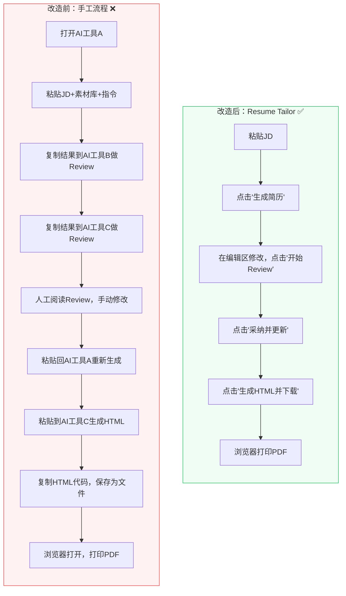
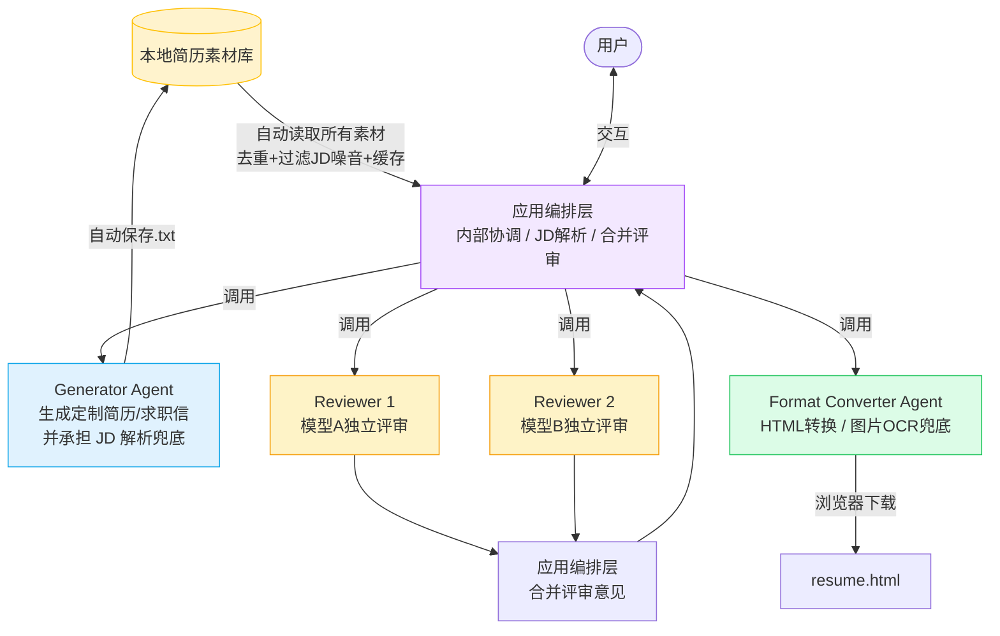
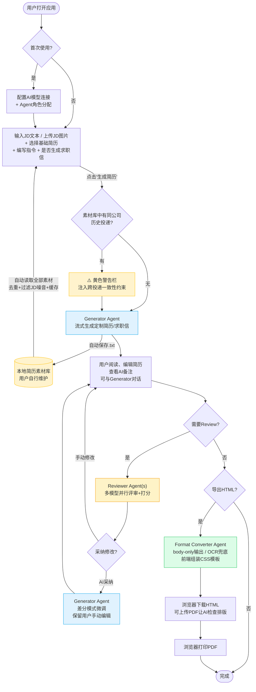
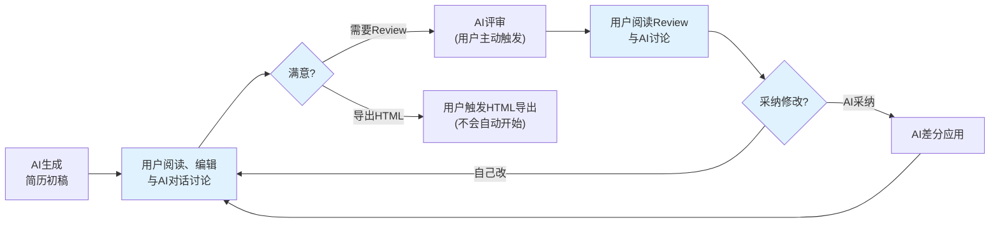
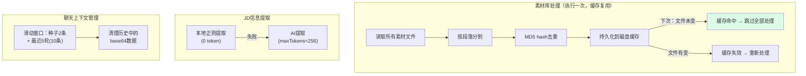
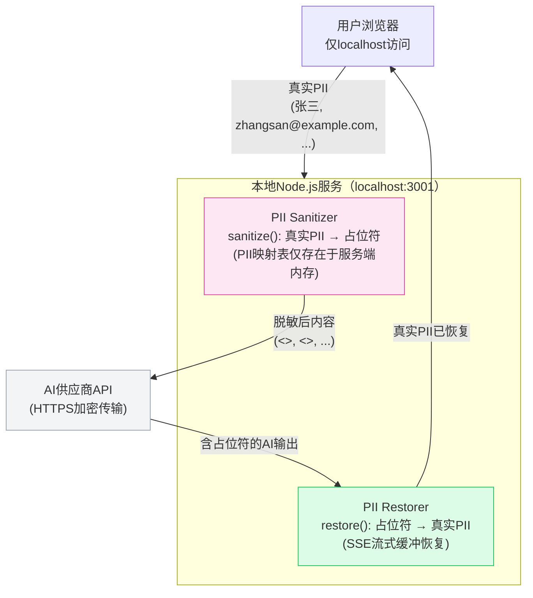
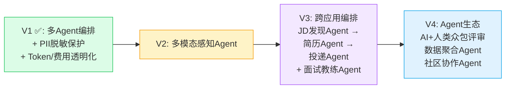

# Resume Tailor — AI多Agent简历定制助手

> 2026-04, wukun2005@gmail.com

[](LICENSE)


---

## 目录

1. [Executive Summary](#1-executive-summary)
2. [快速开始](#2-快速开始)
3. [问题陈述与用户价值](#3-问题陈述与用户价值)
4. [核心功能：多Agent跨应用编排](#4-核心功能多agent跨应用编排)
5. [AI不确定性管理：约束、降级与护栏](#5-ai不确定性管理约束降级与护栏)
6. [Token成本优化战略](#6-token成本优化战略)
7. [使用场景](#7-使用场景)
8. [安全、隐私与合规](#8-安全隐私与合规)
9. [产品路线图](#9-产品路线图)
10. [术语表](#10-术语表)
11. [设计文档](./DESIGN.md)

---

## 1. Executive Summary

**Resume Tailor** 是一个本地运行的AI多Agent简历定制应用。它通过编排多个AI Agent（生成、评审、格式转换、协调），将求职者从"在多个AI工具之间反复复制粘贴"的45分钟手工流程，缩短为"一个应用、一条流水线"的15分钟自动化流程。

### 产品初心：面向JD的诚实叙事重组

Resume Tailor的核心目标**不是"AI写简历"，而是面向JD，基于过去经历的客观事实，调整简历的叙事结构**——展现自身经历中与目标职位最相关的一面。这不是简历造假，而是**同一份经历的不同叙事切面**。

**简历素材库的本质是个人经历的全景知识库**。它承载着用户完整的职业经历、项目成果和技能图谱。当用户输入一份JD时，系统执行的是一个类似RAG（Retrieval-Augmented Generation，检索增强生成）的流程：

```
素材库（全量经历）
    ↓ Matching — 从素材中检索与JD相关的经历线索
    ↓ Ranking — 按相关性排序，筛选最有力的经历
    ↓ Context — 组装最相关的经历上下文
    ↓ Response — 生成调整叙事结构后的定制简历
```

就像同一位候选人面对"产品经理"和"项目经理"两个不同JD，可以分别强调产品战略思维或项目交付能力——事实完全一致，只是叙事重心不同。

#### 诚实性作为系统级硬约束

Resume Tailor将"诚实"作为**系统级硬约束**嵌入产品设计的每个环节，而非依赖用户自觉：

| 原则 | 产品化实现 |
|------|-----------|
| **事实不可捏造** | Generator Prompt硬约束："必须完全依据原始素材，不得编造经历、数据或证书" |
| **Repackaging ≠ Misrepresentation** | 允许对经历重新包装叙述角度，但不允许虚假陈述——skill gap可以弥补，trust gap不可挽回 |
| **Summary必须可被正文验证** | Prompt约束："Summary的强度不能超过经历能承载的上限"——它是可被正文立刻验证的结论，不是愿景 |
| **反关键词堆砌** | Review明确检查："是否存在痕迹过重的JD关键词堆砌（Keyword Stuffing）？是否像在对题作答？" |
| **写窄写深，不写满** | 策略性约束："把候选人最硬的那条线写窄、写实、写深。对于JD，宁可少写，也不要写满" |
| **数字一致性 > 亮点** | Review最高优先级检查项："年限、工作经历开始结束时间在数字上是否有不一致？"——这是最容易触发HR不信任的地方 |
| **过度包装检测** | Reviewer独立检查项："标记无法被原始素材支持的声明"——如果正文撑不起Summary，就是过度包装 |
| **跨投递事实锁定** | 同公司多份投递自动注入一致性约束：事实层（Title/时间线/数据）必须完全一致，表达层（侧重点/关键词）可调 |

> **设计哲学**：与其帮用户包装出一份"完美匹配JD"的简历，不如帮用户从自身真实经历中**找到与JD最契合的那条线**，然后把它讲清楚、讲深透。

### 核心设计理念

| 原则 | 实现 |
|------|------|
| **隐私优先** | 纯本地运行 + PII自动脱敏（姓名/电话/邮箱/社交链接发送AI API前自动替换为占位符），API Key用AES-256-GCM加密 |
| **Token经济与透明** | 三阶段优化实现75-87% input + 52% output token节省；每次调用显示input/output token与折算费用，并显示会话累计成本 |
| **不卡机器** | Node.js限制512MB内存，适配老款笔记本（四核i7/16GB） |
| **朴素UI** | 无动画、无渐变、无视觉特效，功能优先 |
| **一键启动** | `npm run dev` → 打开浏览器 → 开始工作 |

### 产品边界

| Resume Tailor 做什么 | 不做什么 |
|---------------------|----------|
| 根据JD自动生成定制简历和求职信 | HTML→PDF转换（用户在浏览器手动打印） |
| 多模型并行评审并打分 | 管理素材库内容本身 |
| 跨投递一致性自动检查 | 自动投递简历（V3规划） |
| 多轮AI辅助编辑（带上下文记忆） | ATS评分预测 |
| 导出可打印的HTML文件 | 简历模板市场 |
| 灵活配置多供应商AI模型 | 长期职业规划 |
| PII自动脱敏保护（姓名/邮箱/电话/社交链接） | 内容审查或过滤AI输出 |
| 导出预处理文本素材库（供其他AI工具直接使用；默认排除明显 prompt/review/export artifact，并完整纳入 Essay / PRD / Spec / 项目经历等原始工作素材后再去重） | |

---

## 2. 快速开始

### 前置条件

- **Node.js** >= 18
- **Poppler**（用于素材库PDF文本提取）：`brew install poppler`
- 至少一个AI API Key（部分大模型平台提供免费额度）

### 安装与启动

```bash
git clone <本项目仓库URL>
cd resumeTailor
npm install
npm run dev
# 浏览器打开 http://localhost:5173
```

### 首次建议：仿真模式

1. 勾选页面顶部"仿真模式"
2. 按正常流程操作——所有AI输出为预设文本，零API成本
3. 验证工作流无问题后，取消勾选切换到真实AI

### 快速参考

| 我想... | 怎么做 |
|---------|--------|
| 跳过生成，直接Review | 把简历粘贴到编辑区 → 点击"开始Review" |
| 跳过Review，直接导出HTML | 编辑区有简历 → 点击"生成HTML并下载" |
| 更换AI模型 | 设置 → 修改Agent分配 → 保存 |
| 查询 Gemini 模型失败排查 | 先在设置里确认已填正确 API Key；“查询模型”会优先使用输入框当前 Key（无需先保存） |

---

## 3. 问题陈述与用户价值

### 3.1 用户画像

| 维度 | 描述 |
|------|------|
| 身份 | 有技术背景的求职者，能使用命令行 |
| 设备 | macOS笔记本（包括较老的硬件） |
| AI获取方式 | 付费API代理平台和/或免费大模型平台 |
| 简历习惯 | 维护本地素材库文件夹，按JD定制简历 |
| 预算敏感度 | 高度关注AI token成本——每一分钱都重要 |

### 3.2 用户痛点

| # | 痛点 | 影响 |
|---|------|------|
| 1 | **多工具切换**：在多个AI聊天工具之间反复复制粘贴JD、素材库、指令 | 每份简历浪费30+分钟 |
| 2 | **上下文丢失**：多轮编辑中AI忘记之前的修改上下文 | 修改前后不一致 |
| 3 | **版本管理混乱**：向同一公司投递多个职位时，简历之间出现事实矛盾（Title不一致、年份冲突） | HR直接拉黑 |
| 4 | **质量无保障**：单一AI生成无法多维度交叉评审 | 关键词堆砌、过度包装难以发现 |
| 5 | **成本不可控**：不知道一次简历定制要花多少token，用完才知道花了多少钱 | 预算焦虑 |

### 3.3 工作流对比：Before vs. After



**关键改善**：
- **步骤**：3个工具×9步手动操作 → 1个应用×6次点击
- **上下文**：每次重新输入 → 自动管理（素材库、JD、指令、对话历史全部自动维护）
- **一致性**：无 → 自动检测同公司历史投递并注入事实约束

### 3.4 成功指标

| 指标 | 衡量方式 | 目标 |
|------|---------|------|
| 端到端耗时 | 从粘贴JD到导出PDF | < 15分钟（原45+分钟） |
| 人工修改比例 | AI输出中需要人工修改的占比 | < 20% |

---

## 4. 核心功能：多Agent跨应用编排

### 4.1 为什么要做多Agent编排？

传统的"一个AI聊天窗口包办一切"有三个根本问题：

1. **角色冲突**：让同一个AI既生成简历又评审自己的作品，相当于让作者当自己的编辑——它倾向于认可自己的输出
2. **模型局限**：不同AI模型各有所长——有的擅长写作，有的擅长挑错，有的性价比高——单一模型无法覆盖所有需求
3. **用户失控**：一个黑盒流程中，用户无法在关键节点介入审查和修改

多Agent编排的解决思路是 **拆分职责、各专其能、用户掌控关键决策点**：



### 4.2 三个可配置Agent + 一层内部编排

| Agent / 编排层 | 职责 | 推荐模型选择 | 理由 |
|-------|------|------------|------|
| **内部编排层** | 流程协调、JD解析路由、多评审合并 | 不单独配置 | 降低设置复杂度，默认复用 Generator / Reviewer |
| **Generator** | 根据JD+素材库+指令生成定制简历和求职信；承担 JD 解析 AI 兜底 | 旗舰推理模型 | 需要最高写作质量 |
| **Reviewer × N** | 独立评审+打分（支持多个模型并行）；首个 Reviewer 默认承担评审合并/Review 对话 | 多种模型混搭 | 多模型交叉评审降低偏见 |
| **Format Converter** | 纯文本→可打印HTML排版；在本地 OCR 质量差时作为 JD 图片 OCR 的 AI 兜底 | 免费/轻量模型 | 简单任务和 OCR 兜底都适合低成本模型 |

### 4.3 编排的核心价值

| 设计决策 | 解决的问题 | 对用户的好处 |
|---------|-----------|------------|
| 生成与评审分离 | 消除"自己评审自己"的偏见 | 获得真正独立的第三方意见 |
| 多模型并行评审 | 单一模型的盲点和偏见 | 交叉验证，发现更多问题 |
| 每个Agent可配置不同模型 | 成本vs质量的权衡 | 关键环节用好模型，简单环节用免费模型 |
| 用户在每个环节可介入 | AI自动化的不可控性 | 用户始终掌握最终决定权 |
| 差分模式（Diff）应用修改 | 全量重生成破坏用户手动编辑 | 保留用户每一处手动修改 |

### 4.4 两级模型配置系统

用户可以灵活混搭不同AI供应商的不同模型：

**第一级：模型连接** — 配置供应商的API凭证

| 接入类型 | 定价 | 可用模型范围 |
|----------|------|-------------|
| 付费API代理平台 | 按量付费 | 多家供应商的各类模型（推理模型/生成模型/轻量模型等） |
| 免费大模型平台 | 免费（有限额，部分地区需VPN） | 该供应商自有模型 |

> 应用采用**供应商无关架构**：通过统一的SDK路由层，自动根据连接类型选择对应的原生SDK或兼容协议调用，用户无需关心底层协议差异。

**第二级：Agent角色分配** — 为每个Agent选择使用哪个连接

```
┌── 模型连接配置 ────────────────────────────┐
│  ▼ 付费API代理平台A                        │
│  ┌──────────┬────────┬────────┬──────────┐ │
│  │模型类型   │ URL    │ Key    │ Model ID │ │
│  ├──────────┼────────┼────────┼──────────┤ │
│  │供应商X    │ ...    │ ****** │ model-x  │ │
│  │供应商Y    │ ...    │ ****** │ model-y  │ │
│  └──────────┴────────┴────────┴──────────┘ │
│  ▸ 付费API代理平台B [点击展开]              │
│  ▸ 免费大模型平台 [点击展开]                │
├── Agent角色分配 ──────────────────────────── ┤
│  Generator     [代理平台A - 供应商X ▼]      │
│  Reviewer      ☑ 代理平台A-Y ☑ 免费平台    │
│  Format Converter [免费大模型平台 ▼]        │
│                          [保存并连接]       │
└────────────────────────────────────────────┘
```

### 4.5 完整应用工作流



### 4.6 UI布局

```
┌──────────────────────────────────────────────────┐
│  Header: [简历定制助手]     [仿真模式 ☐]  [设置]  │
├──────────────────────────────────────────────────┤
│  输入区                                           │
│  ├── JD输入框                                     │
│  ├── 素材库路径 + [浏览] [加载]                     │
│  ├── 基础简历下拉选择                               │
│  ├── [▸ 生成指令] (可折叠)                          │
│  ├── [▸ HTML格式指令] (可折叠)                      │
│  └── [☐ 同时生成求职信]  [生成简历]                  │
├──────────────────────────────────────────────────┤
│  输出区（始终可见，可跳步操作）                        │
│  ┌────────────────────┬──────────────────────┐    │
│  │ 简历/求职信编辑区     │ Review面板           │    │
│  │ [保存] [重新生成]     │ [开始Review]         │    │
│  │                      │ [采纳并更新简历]      │    │
│  │ ┌──────────────────┐ │ ┌──────────────────┐│    │
│  │ │ 简历编辑器        │ │ │ Review结果       ││    │
│  │ │ (可直接编辑)      │ │ │ (可编辑)         ││    │
│  │ └──────────────────┘ │ └──────────────────┘│    │
│  │ ▸ AI备注 (折叠)      │                      │    │
│  │ Generator对话        │ Review对话           │    │
│  └────────────────────┴──────────────────────┘    │
│  ┌──────────────────────────────────────────┐     │
│  │ [生成HTML并下载]                           │     │
│  │ HTML对话 (支持上传PDF调试排版)              │     │
│  └──────────────────────────────────────────┘     │
└──────────────────────────────────────────────────┘
```

**关键交互设计**：
- 输出区**始终可见**——用户可以跳步操作（直接粘贴已有简历去Review，或直接导出HTML）
- 简历编辑区和Review面板**左右并排**，方便对比阅读和编辑
- 每个功能区都有**独立的AI对话框**，用户可以就该环节的问题与AI讨论
- AI备注**与简历正文分离**显示，不会污染编辑区

---

## 5. AI不确定性管理：约束、降级与护栏

> 构建AI-Native产品的核心挑战：AI的输出是概率性的，不是确定性的。本节记录Resume Tailor如何在系统层面管理AI的不确定性。

### 5.1 约束层（System Constraints）— 限定AI行为边界

| 约束 | 应用场景 | 实现方式 |
|------|---------|---------|
| **结构化输出格式** | 简历生成 | 强制三段式分隔符（`===== 简历正文 =====` / `===== AI备注 =====`），前端解析器拒绝不合格输出 |
| **事实诚实性硬约束** | 生成+评审 | Prompt注入："必须诚实，不得编造经历、数据或证书" |
| **跨投递一致性约束** | 同公司多次投递 | 分层规则：事实层锁定（Title/时间线/数据必须一致），表达层灵活（侧重点可调） |
| **篇幅限制** | 生成+HTML | "必须在2页A4内" |
| **输出token上限** | 每条API路由 | 按路由校准：JD解析=256, 评审=3072, 生成=8192，防止AI过度输出 |
| **Body-only HTML** | HTML生成 | AI只输出`<body>`内HTML，系统用预置CSS模板组装完整文档 |

### 5.2 降级层（Fallbacks）— AI失败时的优雅退化

```mermaid
flowchart TD
    subgraph "JD信息提取"
        JD1["本地正则解析<br/>(tryLocalJdParse)"] -->|成功| JD_OK["使用本地结果<br/>0 token消耗"]
        JD1 -->|失败| JD2["AI提取<br/>(/extract-jd-info)"]
        JD2 -->|失败| JD3["用户手动输入"]
    end

    subgraph "模型自动切换（Model Fallback）"
        M1["首选模型<br/>(高性能)"] -->|配额不足/错误| M2["备用模型1<br/>(Flash Lite)"]
        M2 -->|配额不足/错误| M3["备用模型2<br/>(Flash)"]
        M3 -->|配额不足/错误| M4["备用模型3<br/>(Pro)"]
        M4 -->|所有模型失败| M5["提示用户更换API Key"]
        M2 -->|成功| M_OK["使用备用模型<br/>继续处理"]
        M3 -->|成功| M_OK
        M4 -->|成功| M_OK
    end

    subgraph "评审意见应用（差分模式）"
        D1["AI输出结构化差分指令"] --> D2["严格正则解析"]
        D2 -->|失败| D3["宽松正则解析<br/>(容忍空格差异)"]
        D3 -->|失败| D4["降级：完整重新生成<br/>(指令：保留用户编辑)"]
        D2 -->|成功| D5["差分应用：精确匹配<br/>→ 去空格匹配<br/>→ 行级规范化匹配"]
        D3 -->|成功| D5
        D5 -->|部分失败| D6["应用成功的+提醒失败的"]
    end

    style JD_OK fill:#dcfce7
    style M_OK fill:#dcfce7
    style D6 fill:#fef3c7
```



**Model Fallback 机制**：
- **智能模型优先级**：按性能和配额将模型分为3个优先级（Flash Lite → Flash → Pro）
- **自动切换策略**：配额错误等待5秒后重试，其他错误等待15秒后重试
- **成功恢复**：成功调用后重置模型索引，优先使用高性能模型
- **模型优先级配置**：
  1. **最优先级**（速度极快、配额最高）：gemini-3.1-flash-lite-preview、gemini-2.5-flash-lite、gemini-2.0-flash-lite
  2. **综合能力最强**：gemini-3-flash-preview、gemini-2.5-flash、gemini-2.0-flash  
  3. **高级能力**（配额较低）：gemini-3.1-pro-preview、gemini-3-pro-preview、gemini-2.5-pro
------- REPLACE
'''

**差分匹配三层容错的设计意义**：AI输出的修改指令（"把A改成B"）中的"A"经常和原文有微小差异（多余空格、换行不一致等）。三层匹配确保即使AI不够精确，修改也不会静默丢失：

| 层级 | 匹配策略 | 容忍的差异 |
|------|---------|-----------|
| 第1层 | 精确字符串匹配 | 无 |
| 第2层 | 去除首尾空格后匹配 | 空格、制表符 |
| 第3层 | 按行规范化后匹配 | 换行符、行内多余空格 |
| 最终降级 | 完整重新生成 | 所有（但保留用户编辑指令） |

### 5.3 护栏层（Guardrails）— 防止有害输出

| 风险 | 护栏 |
|------|------|
| **编造经历/数据** | Prompt硬约束 + Review明确检查项："是否存在原始素材中不支持的声明？" |
| **同公司简历矛盾** | 自动检测历史投递 → 注入分层一致性约束 → Review追加跨投递检查维度 |
| **关键词堆砌** | Review检查项："是否存在不自然的关键词堆砌？" |
| **过度包装** | Review检查项："诚实度与过度包装检测——标记无法被原始素材支持的声明" |
| **破坏用户编辑** | 差分模式（AI只输出修改指令而非全量重写） + Prompt指令"保留所有用户手动编辑" |
| **AI成本失控 / 成本黑箱** | 每路由maxTokens上限 + 模型配额可见（RPM/RPD/TPM）+ 每次调用后显示input/output token与折算费用 + 会话累计成本 + 仿真模式 |

> **Token/费用透明化也是一种 Guardrails**：它防的不是“错误答案”，而是“成本上的不确定性惊吓”。用户不再处于“先点生成，事后看账单”的黑箱里，而是始终知道这一步用了多少、这一轮累计多少、所选模型处于什么配额档位。

### 5.4 人在回路（Human-in-the-Loop）设计

Resume Tailor遵循的原则：**AI提议，人做决定**。



**一切操作由用户主动触发**：
- Review不会在生成后自动开始——用户点击"开始Review"
- HTML导出不会自动开始——用户点击"生成HTML并下载"
- 采纳修改不会自动应用——用户点击"采纳并更新简历"

---

## 6. Token成本优化战略

> 核心策略：**不变的上下文预处理一次、持久化缓存、后续直接复用。能本地处理的，不用AI。**

### 6.1 优化效果总览

| 阶段 | 优化方向 | 效果 |
|------|---------|------|
| 第一阶段：Input token | 素材库去重缓存、本地JD解析、供应商Prompt Caching | **75-87% 节省** |
| 第二阶段：Output token | 差分模式、精简prompt、Body-only HTML | **52% 节省** |
| 第三阶段：审计 | 缓存标记优化、CSS精简、差分鲁棒性 | 额外缓存收益 |

### 6.2 Input Token优化策略



| 策略 | 节省 |
|------|------|
| 素材库段落级MD5去重 + 磁盘缓存 | 缓存命中时100%，首次30-60% |
| 本地JD解析（正则提取公司/部门/职位） | 每次~1600 token |
| 供应商Prompt Caching（利用部分供应商API的缓存特性，对重复发送的大块内容标记缓存控制标识，服务端缓存后续请求该部分大幅降低费用） | 缓存命中时90% |
| 聊天历史滑动窗口 + base64清理 | 上限控制在~20K |
| PDF用本地Poppler `pdftotext`提取（非AI OCR） | 远低于AI解析成本 |

### 6.3 Output Token优化策略

| 策略 | 节省 |
|------|------|
| 差分模式应用评审：AI输出`[REPLACE]<<<旧文本>>>新文本[/REPLACE]`而非全量重写 | **79%** |
| Body-only HTML：AI只输出`<body>`内容，前端组装完整文档 | **30%** |
| 多模型评审精简格式：每个Reviewer只输出评分+5条问题+5条建议 | **54%** |
| 按路由校准maxTokens上限 | 防止浪费 |
| 聊天分型system prompt（review/generator/html各不同） | **33%** |

### 6.4 Token与费用透明化：把成本从黑箱变成可管理预期

Token优化解决的是“少花钱”，Token透明化解决的是“别让用户不知道花了多少钱”。二者结合，才构成完整的成本Guardrails。

| 当前已实现的透明化能力 | 产品价值 |
|----------------------|---------|
| **每次调用后显示input/output token** | 用户能看到每一步真实消耗，不再只凭体感判断“这次是不是很贵” |
| **按供应商/连接折算实际费用** | 让“模型选择”从抽象偏好变成可量化决策 |
| **会话级累计成本展示** | 避免用户在一次多轮迭代中失去预算感知 |
| **免费模型明确标注为免费额度** | 降低试错心理门槛，适合先跑工作流再切付费模型 |
| **模型查询时展示RPM/RPD/TPM** | 把可用配额与吞吐能力前置展示，帮助用户预判“便宜但慢”还是“强但配额低” |
| **Orchestrator 调度白盒化与自动降级** | 摒弃隐性硬编码，系统自动探测各提供商连接组构建动态模型矩阵，基于输入输出单价算子对可用轻量模型进行极寒降级（优先免费层），打上推荐标签引导用户节约基础流转花销 |

这部分能力的意义不只是“做了个计数器”，而是在AI产品里补上一个常被忽视的产品层护栏：**把成本不确定性显式化、可解释化、可比较化**。对预算敏感的求职者来说，这种确定感本身就是核心价值。

---

## 7. 使用场景

### 场景1：首次投递一份新职位

用户拿到JD → 粘贴JD文本或上传 1..N 张 JD 图片 → 本地 OCR 提取文本（必要时由 Format Converter 做一次性 AI OCR 兜底）→ 选择基础简历 → 加载素材库 → 点击"生成简历" → AI流式生成定制简历/求职信 → 用户编辑 → 点击"开始Review" → AI多模型评审打分 → 点击"采纳并更新" → 满意后点击"排版" → 系统隐去代码结构并在幽灵容器内构建闭环 HTML DOM → 自动直接唤起操作系统级别的保存 PDF 对话框 → 一键保存矢量无损简历 → 完成。

### 场景2：向同一公司投递第二个职位

用户为某公司A部门的高级产品经理职位生成简历后，又要为该公司B部门的资深产品经理投递。系统自动检测到素材库中已有该公司的历史投递，显示黄色警告"⚠️ 检测到已向[该公司]投递过1份简历/求职信"，并自动在生成和评审的prompt中注入一致性约束——确保Title/时间线/项目数据与上一份完全一致，但Summary/技能排序/项目侧重可以根据新JD调整。

### 场景3：迭代优化

用户对AI生成的简历不完全满意 → 在编辑区手动修改几处表述 → 点击"开始Review"对修改后的版本重新评审 → 阅读评审意见 → 点击"采纳并更新"（AI用差分模式微调，保留用户的手动修改） → 再次编辑 → 满意后导出。

### 场景4：仅格式转换

用户已经有一份满意的txt格式简历（可能是在其他工具中写好的）→ 直接粘贴到简历编辑区 → 跳过"生成"和"Review"步骤 → 直接点击"排版" → 触发系统后台渲染与系统的保护级打印机制 → 一键得到完美原生 PDF。

---

## 8. 安全、隐私与合规

> **核心立场：Don't trust, verify.** 不依赖任何AI供应商的隐私承诺，在架构层面消除PII泄露的可能性。

### 8.1 AI应用的信任危机——为什么隐私是产品的生死线

简历是**最高密度的PII载体**——一页纸上集中了姓名、电话、邮箱、住址、社交链接、完整职业轨迹、教育背景。当用户把简历交给AI应用时，实质上是在交出自己的**完整身份画像**。

当前AI应用的用户面临一个不可回避的信任链条问题：

```
用户 → 本地应用 → AI API供应商 → ???
                                  ├── 日志存储？多久？谁有权访问？
                                  ├── 模型训练数据？opt-out真的生效了吗？
                                  ├── 供应商员工能看到我的简历吗？
                                  ├── 服务器被攻破时我的数据在泄露范围内吗？
                                  └── 隐私政策下次更新会变成什么样？
```

**供应商承诺"不用于训练"≠ 数据安全**。即使供应商的隐私政策写明不使用用户数据进行模型训练，以下风险仍然客观存在：

| 风险类型 | 现实性 |
|---------|--------|
| **日志泄露** | API请求日志通常保留30-90天用于调试，这些日志包含完整的用户输入 |
| **员工访问** | 供应商员工在排查问题时可能接触到用户数据（大多数供应商的ToS允许这一点） |
| **合规政策变更** | 隐私政策可以单方面更新，用户的历史数据可能在新政策下被赋予新的用途 |
| **安全事件** | 服务器被攻破、内部人员泄露——这些不是假设，而是已经发生的事实 |
| **司法管辖** | 不同国家的数据保护法律标准不同，跨境数据流动面临不确定的法律风险 |

**Resume Tailor的设计哲学**：与其要求用户信任AI供应商的承诺，不如在架构层面确保——**即使AI供应商的整个日志数据库被公开泄露，攻击者也无法从中还原出任何一个用户的真实身份信息**。

> 这不仅是安全策略，更是**产品差异化的核心赛道**：当所有AI简历工具都在要求用户"请信任我们的隐私保护"时，Resume Tailor能证明——"你不需要信任任何人，包括我们。"

### 8.2 零信任数据架构

Resume Tailor采用**纵深防御（Defense in Depth）**策略，构建七层安全防线：



**七层纵深防御**：

| 层级 | 防御措施 | 防护目标 | 实现方式 |
|------|---------|---------|---------|
| **L1 本地运行** | 全部代码在localhost运行，无云服务器、无数据库 | 消除数据在途风险和服务端存储风险 | Node.js + Vite本地开发服务器 |
| **L2 PII脱敏** | 所有PII在发送AI API前自动替换为占位符，返回后自动恢复 | **即使AI供应商日志被完全泄露，攻击者也无法还原用户身份** | 服务端拦截层，覆盖全部7条AI路由 |
| **L3 凭证加密** | API Key和PII配置用AES-256-GCM加密存储 | 防止浏览器存储被直接读取 | Web Crypto API + PBKDF2密钥派生（10万次迭代） |
| **L4 路径隔离** | 文件访问限定在白名单目录内 | 防止路径遍历攻击读取系统敏感文件 | `allowedDirs`白名单 + `path.resolve()`前缀校验 |
| **L5 CORS锁定** | 仅接受来自localhost/127.0.0.1的请求 | 防止恶意网页跨站请求本地API | Express CORS中间件严格限制origin |
| **L6 Shell安全** | PDF解析使用`execFile`而非`exec` | 防止命令注入攻击 | 无shell插值，参数直接传递 |
| **L7 零遥测** | 无分析埋点、无追踪代码、无数据收集、无自建后端服务 | **零隐藏数据外传通道**——用户可以完全审计所有网络请求 | 代码完全开源，可自行验证 |

### 8.3 PII脱敏机制详解

#### 覆盖范围

系统对全部7条AI API路由实施PII脱敏，**无一遗漏**：

| 路由 | 脱敏字段 | 恢复方式 |
|------|---------|---------|
| `/generate`（简历生成） | JD、基础简历、指令、历史投递、素材库 | SSE流式恢复 |
| `/review`（评审） | JD、基础简历、待审简历、指令、历史投递、素材库 | SSE流式恢复 |
| `/review-multi`（多模型评审） | 同上；中间结果含占位符直接传递给合并阶段 | SSE流式恢复（合并输出） |
| `/apply-review`（采纳修改） | 当前简历、评审意见、JD、历史投递 | SSE流式恢复 |
| `/chat`（对话） | 全部聊天消息内容（含历史） | SSE流式恢复 |
| `/generate-html`（HTML生成） | 简历文本、格式指令 | SSE流式恢复 |
| `/extract-jd-info`（JD解析） | JD文本 | 无需恢复（返回公司/职位元数据） |
| `/ocr-jd-images`（JD图片 OCR 兜底） | JD 图片（仅在本地 OCR 质量差且用户主动触发时） | 非流式 JSON 返回 |

#### 支持的PII类型

| PII类型 | 占位符 | 匹配策略 | 示例 |
|---------|--------|---------|------|
| 英文姓名 | `<<NAME>>` | 大小写不敏感 | John Smith → `<<NAME>>` |
| 中文姓名 | `<<NAME_ZH>>` | 精确匹配 | 张三 → `<<NAME_ZH>>` |
| 姓名变体 | `<<NAME>>` | 大小写不敏感 | jsmith, SmithJ → `<<NAME>>` |
| 邮箱 | `<<EMAIL>>` | 大小写不敏感 | john@example.com → `<<EMAIL>>` |
| 电话号码 | `<<PHONE>>` | 精确匹配（支持多个） | +86-138xxxx0000 → `<<PHONE>>` |
| LinkedIn | `<<LINKEDIN>>` | 大小写不敏感 | https://linkedin.com/in/example → `<<LINKEDIN>>` |
| GitHub | `<<GITHUB>>` | 大小写不敏感 | https://github.com/example → `<<GITHUB>>` |
| 个人网站 | `<<WEBSITE>>` | 大小写不敏感 | 用户自定义 |
| 其他PII | `<<OTHER>>` | 精确匹配（支持多个） | 家庭住址等 |

#### 关键设计决策

| 设计决策 | 解决的问题 | 技术实现 |
|---------|-----------|---------|
| **长度降序替换** | 邮箱`john@example.com`包含姓名`john`，如果先替换姓名会破坏邮箱 | 按PII值长度降序排列entries数组，长的先替换 |
| **SSE流式缓冲恢复** | AI返回的chunk可能将占位符切断（如`<<EMA`+`IL>>`） | 维护buffer，检测未闭合的`<<`，等待下个chunk补全后再恢复 |
| **PII配置加密存储** | PII值本身（真实姓名/邮箱）也是敏感数据 | 与API Key共用AES-256-GCM加密框架，`pii_`前缀存储 |
| **Chat历史重脱敏** | 上次AI返回已恢复的真实PII保存在聊天历史中，再次发送时需重新脱敏 | 每次`/chat`请求对所有messages重新sanitize |
| **占位符格式`<<>>`** | 需要AI能理解为占位符并原样保留，且不与diff格式`<<<`/`>>>`冲突 | 双尖括号行内使用，三尖括号独立成行，互不干扰 |

#### AI看到什么 vs. 用户看到什么

```
┌─ 用户在浏览器中看到（恢复后）──────────────────┐
│ 张三（John Smith）                               │
│ john@example.com | +86-138xxxx0000               │
│ LinkedIn: https://linkedin.com/in/example        │
│                                                  │
│ Summary                                          │
│ 资深AI产品经理，8年企业级AI平台产品管理经验...     │
└──────────────────────────────────────────────────┘

┌─ AI供应商实际收到的（脱敏后）────────────────────┐
│ <<NAME_ZH>>（<<NAME>>）                          │
│ <<EMAIL>> | <<PHONE>>                            │
│ LinkedIn: <<LINKEDIN>>                           │
│                                                  │
│ Summary                                          │
│ 资深AI产品经理，8年企业级AI平台产品管理经验...     │
└──────────────────────────────────────────────────┘
```

> **结果**：AI供应商的日志中只有占位符。即使日志库被完全泄露，攻击者看到的是`<<NAME>>`和`<<EMAIL>>`，而不是真实的姓名和邮箱。

### 8.4 与行业方案对比

| 维度 | **Resume Tailor** | 云端AI简历工具 | 直接使用ChatGPT/Claude |
|------|:-----------------:|:-------------:|:---------------------:|
| **数据存储位置** | 本地浏览器 | 供应商云服务器 | AI供应商服务器 |
| **PII保护** | 自动脱敏后发送 | 依赖供应商隐私政策 | 无保护 |
| **AI供应商可见内容** | 仅含占位符的文本 | 完整简历 + 全部PII | 完整简历 + 全部PII |
| **API Key安全** | AES-256-GCM本地加密 | N/A（SaaS模式） | N/A |
| **供应商数据泄露影响** | 攻击者**无法还原**用户身份 | **全部PII暴露** | **全部PII暴露** |
| **隐私承诺验证** | 开源代码，用户可自行审计 | 黑盒，无法验证 | 部分开源，但服务端不透明 |
| **网络请求透明度** | 仅AI API调用，可用DevTools完全审计 | 不透明 | 不透明 |

> **核心差异**：其他方案的安全模型是"请信任我们的隐私政策"。Resume Tailor的安全模型是**"你不需要信任任何人——包括我们"**。代码开源，数据流可审计，PII在架构层面就不出本地。

### 8.5 合规性对齐

Resume Tailor作为本地运行的开源工具，不直接受数据保护法规的约束（不收集、不存储、不传输用户数据到自有服务器）。但其设计理念与主要数据保护法规的核心原则高度一致——这是产品**可信度和专业度**的重要加分项：

| 法规原则 | Resume Tailor的对齐实现 |
|---------|----------------------|
| **GDPR Art.5(1)(c) 数据最小化** | PII脱敏确保AI供应商仅接收完成任务所需的最少信息——不含任何可识别个人身份的数据 |
| **GDPR Art.5(1)(e) 存储限制** | 无云存储、无数据库，所有数据仅在用户本地浏览器中，用户随时可清除 |
| **GDPR Art.17 删除权（被遗忘权）** | 用户对数据拥有完全控制权——清除浏览器数据即可彻底删除所有记录 |
| **GDPR Art.25 隐私设计（Privacy by Design）** | PII脱敏不是事后补丁，而是在架构设计阶段就嵌入的系统级保护 |
| **GDPR Art.32 处理安全性** | AES-256-GCM加密、CORS锁定、路径白名单——多层技术措施保护数据安全 |
| **中国《个人信息保护法》知情同意** | 无隐藏数据收集、无遥测、数据流完全透明，用户对每一步操作知情且可控 |
| **中国《个人信息保护法》个人信息出境** | PII在本地完成脱敏后才发送给AI API——**个人信息实质上未出境** |
| **中国《数据安全法》数据分类保护** | PII作为敏感数据被单独识别和脱敏处理，与非敏感的简历内容分开对待 |

> **给求职者的意义**：当你投递到注重数据合规的企业时（如金融、医疗、政府），使用一个**设计理念符合GDPR和《个人信息保护法》精神**的工具来准备简历，本身就传递了你的数据安全意识——这在隐私合规日益被重视的今天，是一个微妙但有价值的信号。

---

## 9. 产品路线图

### V1（当前版本）：单应用内多Agent编排 + PII脱敏 + Token透明化 + 原生打印级PDF + Orchestrator动态降级

三个可配置 Agent（Generator / Reviewer / Format Converter）加上一层内部编排逻辑，在一个本地应用内完成简历定制全流程，并内置 PII 脱敏保护——详见[第8节：安全、隐私与合规](#8-安全隐私与合规)。同时，系统已经把 Token/费用透明化落到了产品层：每次调用后显示 input/output token、按连接折算费用、显示会话累计成本，并在模型发现阶段展示 RPM/RPD/TPM 配额信息。当前版本彻底剥除了中央协调者模型（Orchestrator）在配置文件内的隐性存在，实现了前端下拉可视化与自动按单价降级（节约流转成本）。并在转换域内接入全新的原生打印直出引擎。**已完成并上线。**

### V2：多模态素材支持

- 支持图片（作品集/证书扫描）、视频（项目演示/自我介绍）、源代码（代码仓库/代码片段）、外部社交媒体内容（职业社交平台帖子/博客文章等）
- **价值**：从"文本简历素材"扩展到"全方位职业画像"，AI可以从更丰富的维度理解候选人

### V3：跨应用自动化编排与面试链路

#### V3.1 跨应用自动化编排

- Agent自动搜索网络上的相关JD → 根据JD自动生成定制简历 → 自动投递
- **价值**：从"用户主动找JD"演进到"系统主动发现+匹配+投递"
- **核心挑战**：JD来源多样（各类招聘网站/职业社交平台等）、投递流程差异大、反爬虫

#### V3.2 面试完整链路

- 基于JD自动生成面试问题库 + AI模拟面试官（多角色：技术面试官/HR/业务主管等）
- 实时反馈、答案优化建议、面试表现评分和改进追踪
- 众包评审：以AI模拟面试官为主 + human-in-the-loop人类众包点评
- **价值**：从"写好简历通过初筛"升级到"通过复试/终面"的完整求职链路

### V4：平台化 —— "简历灌篮高手"

- 多用户求职社区平台
- 用户注册和简历库管理
- 社区共享的JD库 + 投递数据
- 众包评审：以AI机器人评审为主 + human-in-the-loop人类众包评审
- 投递成功率排行榜（透明化求职竞争力）
- **价值**：从个人工具演进为求职生态，连接求职者、简历数据和市场反馈

### 核心设计理念：多Agent跨应用编排的演进



从V1到V4，产品的Agent编排在三个维度上持续拓展：

| 维度 | V1 ✅ | V2 | V3 | V4 |
|------|----|----|----|----|
| **Agent数量** | 3个可配置Agent + 内部编排层 + PII拦截层 + 成本透明护栏 | +多模态Agent | +JD搜索/投递/面试Agent | +人类众包/社区Agent |
| **编排范围** | 单应用内 | 单应用内 | 跨应用/跨网站 | 跨平台生态 |
| **人机协作** | 用户主导 | 用户主导 | 半自动 | AI为主+人类众包 |

---

## 10. 术语表

| 术语 | 定义 |
|------|------|
| **JD** | Job Description，职位描述 |
| **素材库** | 用户本地文件夹，包含简历、求职信和职业素材。应用自动读取，用户自行维护 |
| **Agent** | 负责特定任务的AI角色（生成/评审/转换） |
| **连接** | 一组已配置的API凭证（供应商 + URL + Key + Model ID） |
| **内部编排层** | 应用内部的协调逻辑——默认复用 Generator / Reviewer 处理 JD 解析、Review 对话和多评审合并 |
| **Generator** | 生成Agent——生成定制简历和求职信 |
| **Reviewer** | 评审Agent——评审简历并打分（支持多个并行） |
| **Format Converter** | 转换Agent——负责纯文本简历转可打印HTML，并在本地 OCR 质量差时承担 JD 图片 OCR 的 AI 兜底 |
| **仿真模式** | 使用预设数据模拟完整工作流，不消耗API token |
| **Token** | AI API计费单位，与输入/输出文本长度成正比 |
| **跨投递一致性** | 自动检测同公司历史投递，注入事实一致性约束 |
| **差分模式** | 评审应用策略——AI输出`[REPLACE]`修改指令而非全量重写 |
| **素材库摘要** | 排除明显 prompt/review artifact，并把简历、求职信、项目经历、Essay、PRD、Spec 等原始工作素材纳入后去重得到的缓存表示 |
| **PII脱敏** | 个人身份信息（姓名/电话/邮箱/社交链接等）在发送AI API前自动替换为`<<NAME>>`等占位符，AI返回后自动恢复。PII映射表仅存在于本地服务端内存，绝不离开本地 |
| **诚实叙事重组** | 产品核心理念——基于事实调整简历叙事结构以匹配JD，而非编造经历。Repackaging（重新包装叙述角度）而非Misrepresentation（虚假陈述） |

---

## License

MIT

---

> **设计文档**：实现细节、变更记录和开发者指南，请参阅 **[DESIGN.md](./DESIGN.md)**。
