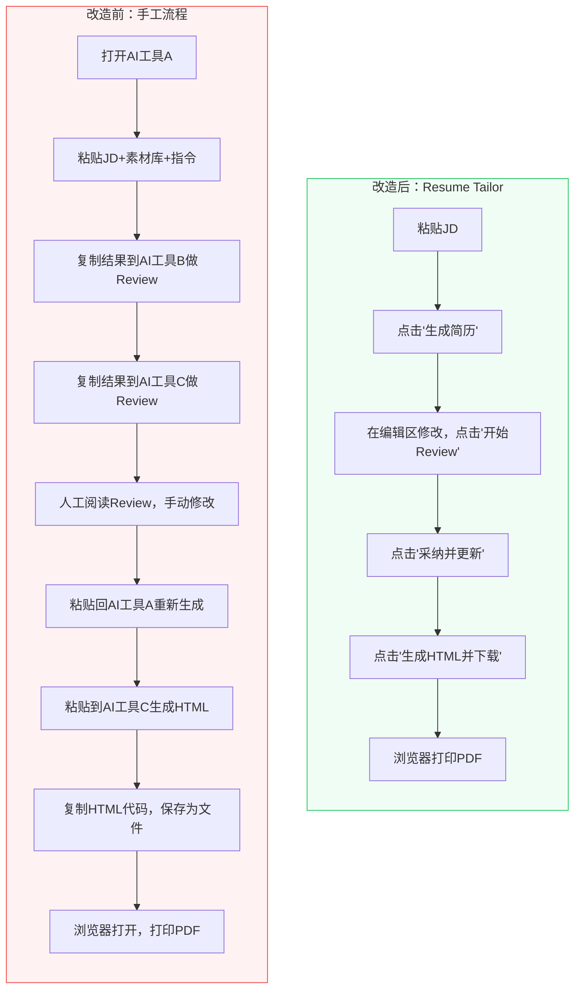
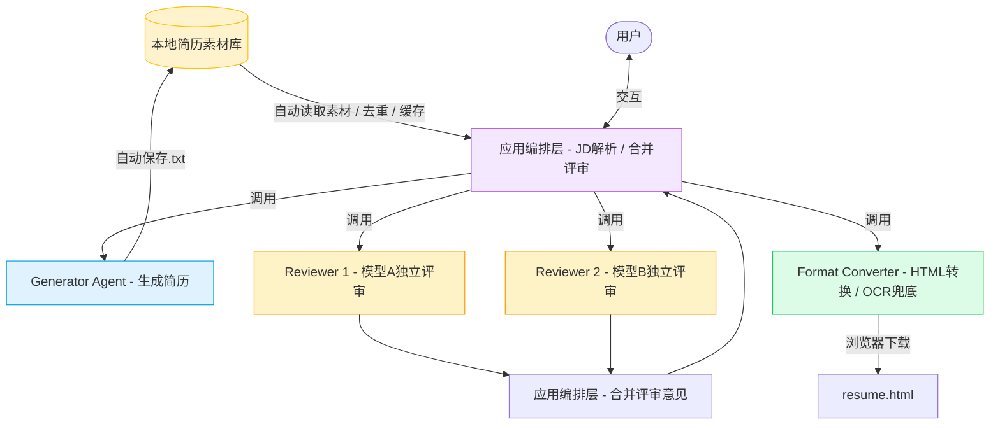
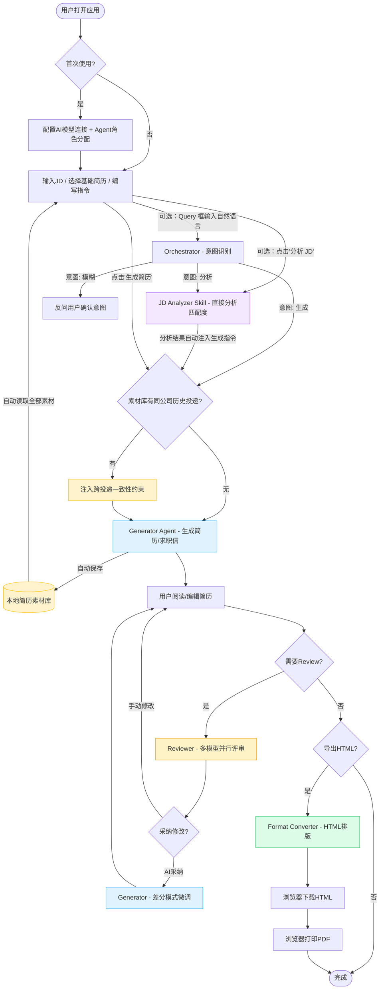

# Resume Tailor — AI多Agent简历定制助手

> 2026-04, wukun2005@gmail.com

[](LICENSE)


---

## 目录

1. [Executive Summary](#1-executive-summary)
2. [快速开始](#2-快速开始)
3. [问题陈述与用户价值](#3-问题陈述与用户价值)
4. [核心功能](#4-核心功能)
5. [Token成本与AI质量管控](#5-token成本与ai质量管控)
6. [使用场景](#6-使用场景)
7. [安全与隐私](#7-安全与隐私)
8. [产品路线图](#8-产品路线图)
9. [术语表](#9-术语表)
10. [设计文档](./DESIGN.md)

---

## 1. Executive Summary

**Resume Tailor** 是一个本地运行的AI多Agent简历定制应用。它通过编排多个AI Agent（生成、评审、格式转换、协调），将求职者从"在多个AI工具之间反复复制粘贴"的45分钟手工流程，缩短为"一个应用、一条流水线"的15分钟自动化流程。

### 产品初心：面向JD的诚实叙事重组

Resume Tailor的核心目标**不是"AI写简历"，而是面向JD，基于过去经历的客观事实，调整简历的叙事结构**——展现自身经历中与目标职位最相关的一面。这不是简历造假，而是**同一份经历的不同叙事切面**。

**简历素材库的本质是个人经历的全景知识库**。当用户输入一份JD时，系统执行的是一个类似RAG的流程：从素材中检索与JD相关的经历线索，按相关性排序，组装最相关的上下文，生成调整叙事结构后的定制简历。

#### 诚实性作为系统级硬约束

Resume Tailor将"诚实"作为**系统级硬约束**嵌入产品设计的每个环节，而非依赖用户自觉：

| 原则 | 产品化实现 |
|------|-----------|
| **事实不可捏造** | Generator Prompt硬约束："必须完全依据原始素材，不得编造经历、数据或证书" |
| **Repackaging ≠ Misrepresentation** | 允许对经历重新包装叙述角度，但不允许虚假陈述 |
| **反关键词堆砌** | Review明确检查："是否存在不自然的关键词堆砌？" |
| **数字一致性 > 亮点** | Review最高优先级检查项："年限、工作经历开始结束时间在数字上是否有不一致？" |
| **跨投递事实锁定** | 同公司多份投递自动注入一致性约束：事实层必须完全一致，表达层可调 |

> **设计哲学**：与其帮用户包装出一份"完美匹配JD"的简历，不如帮用户从自身真实经历中**找到与JD最契合的那条线**，然后把它讲清楚、讲深透。

### 核心设计理念

| 原则 | 实现 |
|------|------|
| **隐私优先** | 纯本地运行 + PII自动脱敏 + API Key用AES-256-GCM加密 |
| **Token经济与透明** | 三阶段优化实现75-87% input + 52% output token节省；每次调用显示token消耗与累计费用 |
| **不卡机器** | Node.js限制512MB内存，适配老款笔记本 |
| **朴素UI** | 无动画、无渐变、无视觉特效，功能优先 |
| **一键启动** | `npm run dev` → 打开浏览器 → 开始工作 |

### 产品边界

| Resume Tailor 做什么 | 不做什么 |
|---------------------|----------|
| 根据JD自动生成定制简历和求职信 | HTML→PDF转换（用户在浏览器手动打印） |
| JD 图片 OCR（本地识别 + AI 兜底） | 管理素材库内容本身 |
| 多模型并行评审并打分 | 自动投递简历（V3规划） |
| 跨投递一致性自动检查 | ATS评分预测 |
| 多轮AI辅助编辑（带上下文记忆） | 简历模板市场 |
| 导出可打印的HTML文件 | 长期职业规划 |
| 灵活配置多供应商AI模型 | |
| PII自动脱敏保护 | |

---

## 2. 快速开始

### 前置条件

- **Node.js** >= 18
- **Poppler**（用于素材库PDF文本提取）：`brew install poppler`
- 至少一个AI API Key（部分大模型平台提供免费额度）

### 安装与启动

```bash
git clone <本项目仓库URL>
cd resumeTailor
npm install
npm run dev
# 浏览器打开 http://localhost:5173
```

### 首次建议：仿真模式

1. 勾选页面顶部"仿真模式"
2. 按正常流程操作——所有AI输出为预设文本，零API成本
3. 验证工作流无问题后，取消勾选切换到真实AI

### 快速参考

| 我想... | 怎么做 |
|---------|--------|
| 跳过生成，直接Review | 把简历粘贴到编辑区 → 点击"开始Review" |
| 跳过Review，直接导出HTML | 编辑区有简历 → 点击"生成HTML并下载" |
| 更换AI模型 | 设置 → 修改Agent分配 → 保存 |
| 查询 Gemini 模型失败排查 | 先在设置里确认已填正确 API Key；"查询模型"会优先使用输入框当前 Key |

### 运行测试

```bash
# 确保 .env 文件包含 GEMINI_KEY
npm run dev   # 启动服务器
node test-e2e.mjs
```

---

## 3. 问题陈述与用户价值

### 用户画像

| 维度 | 描述 |
|------|------|
| 身份 | 有技术背景的求职者，能使用命令行 |
| 设备 | macOS笔记本（包括较老的硬件） |
| AI获取方式 | 付费API代理平台和/或免费大模型平台 |
| 简历习惯 | 维护本地素材库文件夹，按JD定制简历 |
| 预算敏感度 | 高度关注AI token成本 |

### 用户痛点

| # | 痛点 | 影响 |
|---|------|------|
| 1 | **多工具切换**：在多个AI聊天工具之间反复复制粘贴 | 每份简历浪费30+分钟 |
| 2 | **上下文丢失**：多轮编辑中AI忘记之前的修改上下文 | 修改前后不一致 |
| 3 | **版本管理混乱**：向同一公司投递多个职位时，简历之间出现事实矛盾 | HR直接拉黑 |
| 4 | **质量无保障**：单一AI生成无法多维度交叉评审 | 关键词堆砌、过度包装难以发现 |
| 5 | **成本不可控**：不知道一次简历定制要花多少token | 预算焦虑 |

### 工作流对比

| | 改造前：手工流程 | 改造后：Resume Tailor |
|---|---|---|
| **步骤** | 3个工具 × 9步手动操作 | 1个应用 × 6次点击 |
| **上下文** | 每次重新输入 | 自动管理（素材库、JD、指令、对话历史） |
| **一致性** | 无 | 自动检测同公司历史投递并注入事实约束 |
| **耗时** | 45+ 分钟 | < 15 分钟 |


```mermaid
flowchart LR
    subgraph BEFORE ["改造前：手工流程"]
        direction TB
        B1["打开AI工具A"] --> B2["粘贴JD+素材库+指令"]
        B2 --> B3["复制结果到AI工具B做Review"]
        B3 --> B4["复制结果到AI工具C做Review"]
        B4 --> B5["人工阅读Review，手动修改"]
        B5 --> B6["粘贴回AI工具A重新生成"]
        B6 --> B7["粘贴到AI工具C生成HTML"]
        B7 --> B8["复制HTML代码，保存为文件"]
        B8 --> B9["浏览器打开，打印PDF"]
    end

    subgraph AFTER ["改造后：Resume Tailor"]
        direction TB
        A1["粘贴JD"] --> A2["点击'生成简历'"]
        A2 --> A3["在编辑区修改，点击'开始Review'"]
        A3 --> A4["点击'采纳并更新'"]
        A4 --> A5["点击'生成HTML并下载'"]
        A5 --> A6["浏览器打印PDF"]
    end

    BEFORE ~~~ AFTER

    style BEFORE fill:#fef2f2,stroke:#ef4444
    style AFTER fill:#f0fdf4,stroke:#22c55e
```

---

## 4. 核心功能

### 多Agent编排

传统的"一个AI聊天窗口包办一切"存在角色冲突（自己评审自己）、模型局限和用户失控问题。Resume Tailor 拆分职责、各专其能、用户掌控关键决策点：

| Agent / 编排层 | 职责 | 推荐模型 |
|-------|------|---------|
| **Orchestrator** | 意图路由（分析/生成/澄清）；JD深度拆解+素材库匹配度评估 | 默认复用 Generator |
| **Generator** | 生成定制简历和求职信；JD解析AI兜底 | 旗舰推理模型 |
| **Reviewer × N** | 独立评审+打分（支持多个模型并行） | 多种模型混搭 |
| **Format Converter** | 纯文本→可打印HTML；JD图片OCR兜底 | 免费/轻量模型 |
| **Preprocessor** | 素材库AI预处理（可选） | 免费/轻量模型 |


```mermaid
flowchart TD
    LIB[(本地简历素材库)] -->|自动读取素材 / 去重 / 缓存| APP

    USER([用户]) <-->|交互| APP["应用编排层 - JD解析 / 合并评审"]

    APP -->|调用| GEN["Generator Agent - 生成简历"]
    APP -->|调用| REV1["Reviewer 1 - 模型A独立评审"]
    APP -->|调用| REV2["Reviewer 2 - 模型B独立评审"]
    APP -->|调用| HTMLA["Format Converter - HTML转换 / OCR兜底"]

    REV1 --> MERGE["应用编排层 - 合并评审意见"]
    REV2 --> MERGE
    MERGE --> APP

    GEN -->|自动保存.txt| LIB
    HTMLA -->|浏览器下载| DL["resume.html"]

    style LIB fill:#fff3cd,stroke:#ffc107
    style APP fill:#f3e8ff,stroke:#a855f7
    style GEN fill:#e0f2fe,stroke:#0ea5e9
    style REV1 fill:#fef3c7,stroke:#f59e0b
    style REV2 fill:#fef3c7,stroke:#f59e0b
    style HTMLA fill:#dcfce7,stroke:#22c55e
```

**核心价值**：生成与评审分离消除偏见，多模型交叉评审发现更多问题，用户在每个环节可介入。

### 意图识别驱动的 Skill 调用

Resume Tailor 采用**意图识别 → Skill 调用**的架构模式：用户用自然语言表达需求，Orchestrator 自动识别意图并调用对应的 Skill（能力模块），无需用户记住按钮位置或操作流程。

**两种交互方式**：

| 入口 | 行为 | 适用场景 |
|------|------|---------|
| **按钮**（如「分析 JD」） | 直接调用对应 Skill | 用户明确知道要做什么 |
| **自然语言输入**（Query 框） | Orchestrator 识别意图 → 自动路由到正确 Skill | 用户用自然语言表达需求 |

**用户价值**：

- **降低认知负担**：不需要记住"先分析再生成"的流程，直接说"帮我看看这个岗位怎么样"
- **智能路由**：Orchestrator 理解用户意图，自动选择正确的 Skill（分析/生成/澄清）
- **可扩展性**：新增 Skill 只需注册到路由表，用户无需学习新的操作方式
- **容错与引导**：意图模糊时主动反问，避免误操作

**示例**：

```
用户输入: "这个岗位怎么样？"      → Orchestrator → JD Analyzer Skill（分析匹配度）
用户输入: "帮我看看这个JD"        → Orchestrator → JD Analyzer Skill（分析匹配度）
用户输入: "帮我生成简历"          → Orchestrator → 提示直接点击「生成简历」按钮
用户输入: "帮我处理一下"          → Orchestrator → 反问用户意图
```

### 两级模型配置

**第一级：模型连接** — 配置供应商的API凭证（7个可选连接，覆盖 Jiekou.ai / OpenRouter.ai / Google AI Studio）

**第二级：Agent角色分配** — 将已配置的连接分配给各 Agent

> 应用采用**供应商无关架构**：通过统一的SDK路由层，自动根据连接类型选择对应的原生SDK或兼容协议调用，用户无需关心底层协议差异。

详见 [DESIGN.md — 多模型连接系统](./DESIGN.md#3-多模型连接系统)。

### 完整工作流


```mermaid
flowchart TD
    START([用户打开应用]) --> CONFIG{首次使用?}
    CONFIG -->|是| SETTINGS["配置AI模型连接 + Agent角色分配"]
    CONFIG -->|否| INPUT
    SETTINGS --> INPUT

    LIB[(本地简历素材库)] -->|自动读取全部素材| INPUT
    INPUT["输入JD / 选择基础简历 / 编写指令"]
    INPUT -->|可选：点击'分析 JD'| ANALYZE["JD Analyzer Skill - 直接分析匹配度"]
    INPUT -->|可选：Query 框输入自然语言| ROUTE["Orchestrator - 意图识别"]
    ROUTE -->|意图: 分析| ANALYZE
    ROUTE -->|意图: 生成| CONSIST
    ROUTE -->|意图: 模糊| CLARIFY["反问用户确认意图"]
    ANALYZE -->|分析结果自动注入生成指令| CONSIST
    INPUT -->|点击'生成简历'| CONSIST

    CONSIST{"素材库有同公司历史投递?"}
    CONSIST -->|有| WARN["注入跨投递一致性约束"]
    CONSIST -->|无| GEN
    WARN --> GEN

    GEN["Generator Agent - 生成简历/求职信"]
    GEN -->|自动保存| LIB
    GEN --> EDIT["用户阅读/编辑简历"]
    EDIT --> REVIEW_Q{需要Review?}

    REVIEW_Q -->|是| REVIEW["Reviewer - 多模型并行评审"]
    REVIEW_Q -->|否| HTML_Q

    REVIEW --> APPLY_Q{"采纳修改?"}
    APPLY_Q -->|AI采纳| APPLY["Generator - 差分模式微调"]
    APPLY_Q -->|手动修改| EDIT

    APPLY --> EDIT

    HTML_Q{导出HTML?}
    HTML_Q -->|是| HTML["Format Converter - HTML排版"]
    HTML_Q -->|否| DONE

    HTML --> DOWNLOAD["浏览器下载HTML"]
    DOWNLOAD --> PDF["浏览器打印PDF"]
    PDF --> DONE([完成])

    style LIB fill:#fff3cd,stroke:#ffc107
    style WARN fill:#fff3cd,stroke:#ffc107
    style GEN fill:#e0f2fe,stroke:#0ea5e9
    style ANALYZE fill:#f3e8ff,stroke:#a855f7
    style REVIEW fill:#fef3c7,stroke:#f59e0b
    style APPLY fill:#e0f2fe,stroke:#0ea5e9
    style HTML fill:#dcfce7,stroke:#22c55e
```

---

## 5. Token成本与AI质量管控

Resume Tailor 通过三层机制管理 AI 的不确定性和成本：

1. **约束层**：结构化输出格式、事实诚实性硬约束、篇幅限制、按路由校准 maxTokens 上限
2. **降级层**：本地 JD 解析（0 token）→ AI 兜底 → 手动输入；模型自动 Fallback（配额不足时自动切换备用模型）；差分模式三层容错匹配
3. **护栏层**：Prompt 硬约束防编造、跨投递一致性检查、Review 防关键词堆砌、一切操作由用户主动触发

**人机协作原则：AI提议，人做决定**。Review、HTML导出、采纳修改均由用户主动触发，不会自动执行。

### 优化效果

| 阶段 | 优化方向 | 效果 |
|------|---------|------|
| 第一阶段 | Input token（素材库去重缓存、本地JD解析、Prompt Caching） | **75-87% 节省** |
| 第二阶段 | Output token（差分模式、精简prompt、Body-only HTML） | **52% 节省** |
| 第三阶段 | 缓存标记优化、CSS精简、差分鲁棒性 | 额外缓存收益 |

详见 [DESIGN.md — AI不确定性管理](./DESIGN.md#15-ai不确定性管理) 和 [DESIGN.md — Token成本优化战略](./DESIGN.md#16-token成本优化战略)。

---

## 6. 使用场景

### 场景1：首次投递一份新职位

粘贴JD或上传JD图片 → 选择基础简历 → 加载素材库 → 生成简历 → 编辑 → Review → 采纳修改 → 导出HTML → 浏览器打印PDF。

### 场景2：向同一公司投递第二个职位

系统自动检测素材库中已有该公司的历史投递，自动注入跨投递一致性约束——确保事实层完全一致，表达层可调整。

### 场景3：迭代优化

手动修改 → 重新Review → AI差分模式微调（保留用户手动修改）→ 再次编辑 → 导出。

### 场景4：仅格式转换

已有满意简历 → 直接粘贴到编辑区 → 跳过生成和Review → 直接导出HTML → 打印PDF。

### 场景5：导出预处理素材库

加载素材库 → 导出预处理文本（可选AI预处理）→ 用于其他AI工具。

### 场景6：生成前评估JD匹配度

**方式一（按钮）**：粘贴JD → 点击「分析 JD」→ 直接深度拆解硬性要求/加分项，对照素材库给出匹配度（有戏/勉强/没戏）、优势区和短板区 → 分析结果自动注入生成指令，引导 Generator 侧重点。

**方式二（自然语言）**：粘贴JD → 在 Query 框输入「这个岗位怎么样？」→ Orchestrator 识别意图为分析 → 自动触发 JD Analyzer Skill → 展示分析报告。

---

## 7. 安全与隐私

> **核心立场：Don't trust, verify.** 不依赖任何AI供应商的隐私承诺，在架构层面消除PII泄露的可能性。

Resume Tailor 采用纵深防御策略：纯本地运行（L1）、PII脱敏后才发送AI API（L2）、API Key AES-256-GCM加密（L3）、文件路径白名单（L4）、CORS锁定（L5）、Shell安全（L6）、零遥测（L7）。

**结果**：即使AI供应商的整个日志数据库被公开泄露，攻击者也无法从中还原出任何一个用户的真实身份信息——AI看到的只有 `<<NAME>>` 和 `<<EMAIL>>` 等占位符。

### 与行业方案对比

| 维度 | **Resume Tailor** | 云端AI简历工具 | 直接使用ChatGPT/Claude |
|------|:-----------------:|:-------------:|:---------------------:|
| **PII保护** | 自动脱敏后发送 | 依赖隐私政策 | 无保护 |
| **供应商可见内容** | 仅含占位符的文本 | 完整简历+全部PII | 完整简历+全部PII |
| **隐私承诺验证** | 开源代码，可自行审计 | 黑盒 | 部分开源 |

详见 [DESIGN.md — 安全设计](./DESIGN.md#13-安全设计) 和 [DESIGN.md — 安全实现细节](./DESIGN.md#17-安全实现细节)。

---

## 8. 产品路线图

### V1（当前版本）：多Agent编排 + PII脱敏 + Token透明化

三个可配置 Agent 加上一层内部编排逻辑，在一个本地应用内完成简历定制全流程，并内置 PII 脱敏保护和 Token/费用透明化。**已完成。**

### V2：多模态素材支持

支持图片、视频、源代码、外部社交媒体内容等素材。

### V3：跨应用自动化编排与面试链路

Agent自动搜索JD → 生成简历 → 自动投递；AI模拟面试官 + 众包评审。

### V4：平台化

多用户求职社区平台，AI+人类众包评审，投递成功率排行榜。

---

## 9. 术语表

| 术语 | 定义 |
|------|------|
| **JD** | Job Description，职位描述 |
| **素材库** | 用户本地文件夹，包含简历、求职信和职业素材 |
| **Agent** | 负责特定任务的AI角色（编排/生成/评审/转换） |
| **Orchestrator** | 编排Agent——意图路由（分析/生成/澄清）+ JD深度拆解与匹配度评估 |
| **JD Analyzer** | Orchestrator 的子功能：对照素材库分析JD匹配度，输出硬性要求、加分项、优势/短板、匹配度判断 |
| **连接** | 一组已配置的API凭证（供应商 + URL + Key + Model ID） |
| **Generator** | 生成Agent——生成定制简历和求职信 |
| **Reviewer** | 评审Agent——评审简历并打分（支持多个并行） |
| **Format Converter** | 转换Agent——纯文本转可打印HTML + JD图片OCR兜底 |
| **仿真模式** | 使用预设数据模拟完整工作流，不消耗API token |
| **跨投递一致性** | 自动检测同公司历史投递，注入事实一致性约束 |
| **差分模式** | AI输出`[REPLACE]`修改指令而非全量重写 |
| **PII脱敏** | 个人身份信息在发送AI API前自动替换为占位符，返回后自动恢复 |

---

## License

MIT

---

> **设计文档**：实现细节、变更记录和开发者指南，请参阅 **[DESIGN.md](./DESIGN.md)**。
